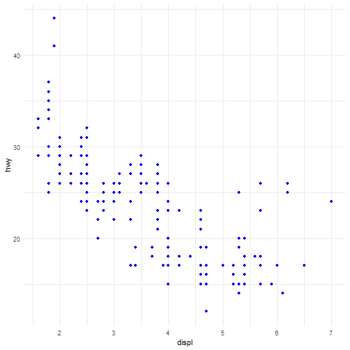
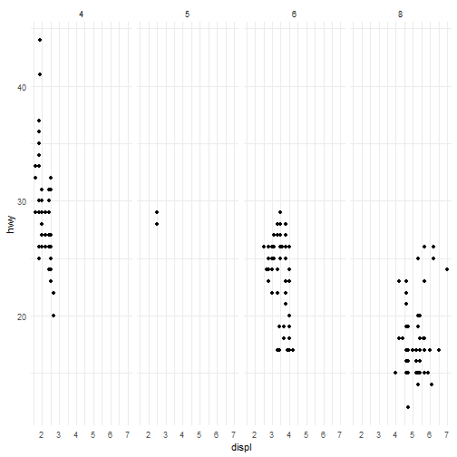
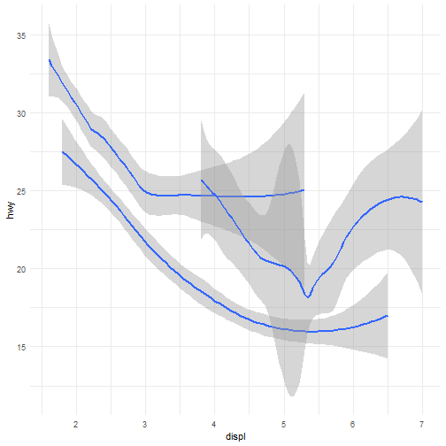
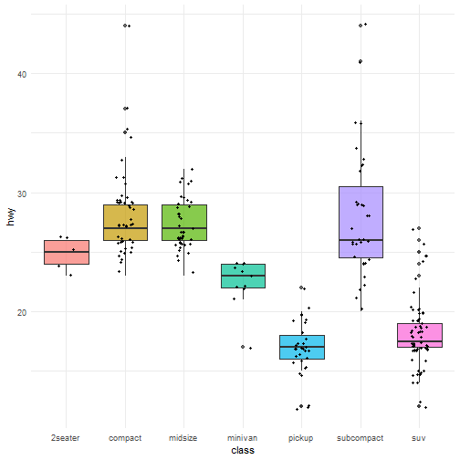
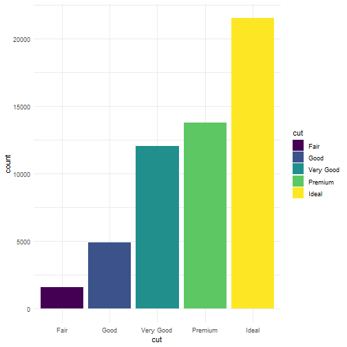

# Workshop 04. Introduction

This page explores the use of data file systems and programming tools to access, organise, analyse and visualise large datasets.

# Load the data (mpg is built into ggplot2)


``` r
data(mpg)
```

# Quick data checks list


``` r
head(mpg)
```

```
## # A tibble: 6 × 11
##   manufacturer model displ  year   cyl trans      drv     cty   hwy fl    class  
##   <chr>        <chr> <dbl> <int> <int> <chr>      <chr> <int> <int> <chr> <chr>  
## 1 audi         a4      1.8  1999     4 auto(l5)   f        18    29 p     compact
## 2 audi         a4      1.8  1999     4 manual(m5) f        21    29 p     compact
## 3 audi         a4      2    2008     4 manual(m6) f        20    31 p     compact
## 4 audi         a4      2    2008     4 auto(av)   f        21    30 p     compact
## 5 audi         a4      2.8  1999     6 auto(l5)   f        16    26 p     compact
## 6 audi         a4      2.8  1999     6 manual(m5) f        18    26 p     compact
```

``` r
glimpse(mpg)
```

```
## Rows: 234
## Columns: 11
## $ manufacturer <chr> "audi", "audi", "audi", "audi", "audi", "audi", "audi", "audi", "audi", "audi", "audi", "audi", "audi", "audi",…
## $ model        <chr> "a4", "a4", "a4", "a4", "a4", "a4", "a4", "a4 quattro", "a4 quattro", "a4 quattro", "a4 quattro", "a4 quattro",…
## $ displ        <dbl> 1.8, 1.8, 2.0, 2.0, 2.8, 2.8, 3.1, 1.8, 1.8, 2.0, 2.0, 2.8, 2.8, 3.1, 3.1, 2.8, 3.1, 4.2, 5.3, 5.3, 5.3, 5.7, 6…
## $ year         <int> 1999, 1999, 2008, 2008, 1999, 1999, 2008, 1999, 1999, 2008, 2008, 1999, 1999, 2008, 2008, 1999, 2008, 2008, 200…
## $ cyl          <int> 4, 4, 4, 4, 6, 6, 6, 4, 4, 4, 4, 6, 6, 6, 6, 6, 6, 8, 8, 8, 8, 8, 8, 8, 8, 8, 8, 8, 8, 8, 8, 8, 4, 4, 6, 6, 6, …
## $ trans        <chr> "auto(l5)", "manual(m5)", "manual(m6)", "auto(av)", "auto(l5)", "manual(m5)", "auto(av)", "manual(m5)", "auto(l…
## $ drv          <chr> "f", "f", "f", "f", "f", "f", "f", "4", "4", "4", "4", "4", "4", "4", "4", "4", "4", "4", "r", "r", "r", "r", "…
## $ cty          <int> 18, 21, 20, 21, 16, 18, 18, 18, 16, 20, 19, 15, 17, 17, 15, 15, 17, 16, 14, 11, 14, 13, 12, 16, 15, 16, 15, 15,…
## $ hwy          <int> 29, 29, 31, 30, 26, 26, 27, 26, 25, 28, 27, 25, 25, 25, 25, 24, 25, 23, 20, 15, 20, 17, 17, 26, 23, 26, 25, 24,…
## $ fl           <chr> "p", "p", "p", "p", "p", "p", "p", "p", "p", "p", "p", "p", "p", "p", "p", "p", "p", "p", "r", "e", "r", "r", "…
## $ class        <chr> "compact", "compact", "compact", "compact", "compact", "compact", "compact", "compact", "compact", "compact", "…
```

``` r
summary(mpg)
```

```
##  manufacturer          model               displ            year           cyl           trans               drv           
##  Length:234         Length:234         Min.   :1.600   Min.   :1999   Min.   :4.000   Length:234         Length:234        
##  Class :character   Class :character   1st Qu.:2.400   1st Qu.:1999   1st Qu.:4.000   Class :character   Class :character  
##  Mode  :character   Mode  :character   Median :3.300   Median :2004   Median :6.000   Mode  :character   Mode  :character  
##                                        Mean   :3.472   Mean   :2004   Mean   :5.889                                        
##                                        3rd Qu.:4.600   3rd Qu.:2008   3rd Qu.:8.000                                        
##                                        Max.   :7.000   Max.   :2008   Max.   :8.000                                        
##       cty             hwy             fl               class          
##  Min.   : 9.00   Min.   :12.00   Length:234         Length:234        
##  1st Qu.:14.00   1st Qu.:18.00   Class :character   Class :character  
##  Median :17.00   Median :24.00   Mode  :character   Mode  :character  
##  Mean   :16.86   Mean   :23.44                                        
##  3rd Qu.:19.00   3rd Qu.:27.00                                        
##  Max.   :35.00   Max.   :44.00
```
# Create your first plot


``` r
ggplot(data = mpg) + 
  geom_point(mapping = aes(x = displ, y = hwy))
```

```
## Warning in grid.Call(C_textBounds, as.graphicsAnnot(x$label), x$x, x$y, : famiglia di caratteri non trovata nel database dei
## caratteri di Windows
## Warning in grid.Call(C_textBounds, as.graphicsAnnot(x$label), x$x, x$y, : famiglia di caratteri non trovata nel database dei
## caratteri di Windows
```

```
## Warning in grid.Call.graphics(C_text, as.graphicsAnnot(x$label), x$x, x$y, : famiglia di caratteri non trovata nel database dei
## caratteri di Windows
## Warning in grid.Call.graphics(C_text, as.graphicsAnnot(x$label), x$x, x$y, : famiglia di caratteri non trovata nel database dei
## caratteri di Windows
## Warning in grid.Call.graphics(C_text, as.graphicsAnnot(x$label), x$x, x$y, : famiglia di caratteri non trovata nel database dei
## caratteri di Windows
```


The plot shows a negative relationship between engine size (displ) and fuel efficiency (hwy). In other words, cars with big engines use more fuel. What does this say about fuel efficiency and engine size?

# 1. Understanding the grammar of graphics

What happens if we just try to run ggplot on its own?


``` r
ggplot() 
```


``` r
# Or with just the data specified?
ggplot(data = mpg)
```


We need to map some aesthetics!!

# When you’re creating a plot, you essentially need TWO attributes of a plot: a geom and aesthetics


``` r
ggplot(data = mpg) + 
  geom_point(mapping = aes(x = displ, y = hwy, colour = class))
```

```
## Warning in grid.Call(C_textBounds, as.graphicsAnnot(x$label), x$x, x$y, : famiglia di caratteri non trovata nel database dei
## caratteri di Windows
## Warning in grid.Call(C_textBounds, as.graphicsAnnot(x$label), x$x, x$y, : famiglia di caratteri non trovata nel database dei
## caratteri di Windows
```

```
## Warning in grid.Call.graphics(C_text, as.graphicsAnnot(x$label), x$x, x$y, : famiglia di caratteri non trovata nel database dei
## caratteri di Windows
## Warning in grid.Call.graphics(C_text, as.graphicsAnnot(x$label), x$x, x$y, : famiglia di caratteri non trovata nel database dei
## caratteri di Windows
## Warning in grid.Call.graphics(C_text, as.graphicsAnnot(x$label), x$x, x$y, : famiglia di caratteri non trovata nel database dei
## caratteri di Windows
## Warning in grid.Call.graphics(C_text, as.graphicsAnnot(x$label), x$x, x$y, : famiglia di caratteri non trovata nel database dei
## caratteri di Windows
## Warning in grid.Call.graphics(C_text, as.graphicsAnnot(x$label), x$x, x$y, : famiglia di caratteri non trovata nel database dei
## caratteri di Windows
```


# Change POINT COLOR by class


``` r
ggplot(data = mpg) + 
  geom_point(mapping = aes(x = displ, y = hwy, colour = class))
```

```
## Warning in grid.Call(C_textBounds, as.graphicsAnnot(x$label), x$x, x$y, : famiglia di caratteri non trovata nel database dei
## caratteri di Windows
## Warning in grid.Call(C_textBounds, as.graphicsAnnot(x$label), x$x, x$y, : famiglia di caratteri non trovata nel database dei
## caratteri di Windows
```

```
## Warning in grid.Call.graphics(C_text, as.graphicsAnnot(x$label), x$x, x$y, : famiglia di caratteri non trovata nel database dei
## caratteri di Windows
## Warning in grid.Call.graphics(C_text, as.graphicsAnnot(x$label), x$x, x$y, : famiglia di caratteri non trovata nel database dei
## caratteri di Windows
## Warning in grid.Call.graphics(C_text, as.graphicsAnnot(x$label), x$x, x$y, : famiglia di caratteri non trovata nel database dei
## caratteri di Windows
## Warning in grid.Call.graphics(C_text, as.graphicsAnnot(x$label), x$x, x$y, : famiglia di caratteri non trovata nel database dei
## caratteri di Windows
## Warning in grid.Call.graphics(C_text, as.graphicsAnnot(x$label), x$x, x$y, : famiglia di caratteri non trovata nel database dei
## caratteri di Windows
```


# Change POINT SIZE by class


``` r
ggplot(data = mpg) + 
  geom_point(mapping = aes(x = displ, y = hwy, size = class))
```

```
## Warning: Using size for a discrete variable is not advised.
```

```
## Warning in grid.Call(C_textBounds, as.graphicsAnnot(x$label), x$x, x$y, : famiglia di caratteri non trovata nel database dei
## caratteri di Windows
## Warning in grid.Call(C_textBounds, as.graphicsAnnot(x$label), x$x, x$y, : famiglia di caratteri non trovata nel database dei
## caratteri di Windows
```

```
## Warning in grid.Call.graphics(C_text, as.graphicsAnnot(x$label), x$x, x$y, : famiglia di caratteri non trovata nel database dei
## caratteri di Windows
## Warning in grid.Call.graphics(C_text, as.graphicsAnnot(x$label), x$x, x$y, : famiglia di caratteri non trovata nel database dei
## caratteri di Windows
## Warning in grid.Call.graphics(C_text, as.graphicsAnnot(x$label), x$x, x$y, : famiglia di caratteri non trovata nel database dei
## caratteri di Windows
## Warning in grid.Call.graphics(C_text, as.graphicsAnnot(x$label), x$x, x$y, : famiglia di caratteri non trovata nel database dei
## caratteri di Windows
## Warning in grid.Call.graphics(C_text, as.graphicsAnnot(x$label), x$x, x$y, : famiglia di caratteri non trovata nel database dei
## caratteri di Windows
```


Note the warning!!!

# Change TRANSPARENCY (alpha) by class


``` r
ggplot(data = mpg) + 
  geom_point(mapping = aes(x = displ, y = hwy, alpha = class))
```

```
## Warning: Using alpha for a discrete variable is not advised.
```

```
## Warning in grid.Call(C_textBounds, as.graphicsAnnot(x$label), x$x, x$y, : famiglia di caratteri non trovata nel database dei
## caratteri di Windows
## Warning in grid.Call(C_textBounds, as.graphicsAnnot(x$label), x$x, x$y, : famiglia di caratteri non trovata nel database dei
## caratteri di Windows
```

```
## Warning in grid.Call.graphics(C_text, as.graphicsAnnot(x$label), x$x, x$y, : famiglia di caratteri non trovata nel database dei
## caratteri di Windows
## Warning in grid.Call.graphics(C_text, as.graphicsAnnot(x$label), x$x, x$y, : famiglia di caratteri non trovata nel database dei
## caratteri di Windows
## Warning in grid.Call.graphics(C_text, as.graphicsAnnot(x$label), x$x, x$y, : famiglia di caratteri non trovata nel database dei
## caratteri di Windows
## Warning in grid.Call.graphics(C_text, as.graphicsAnnot(x$label), x$x, x$y, : famiglia di caratteri non trovata nel database dei
## caratteri di Windows
## Warning in grid.Call.graphics(C_text, as.graphicsAnnot(x$label), x$x, x$y, : famiglia di caratteri non trovata nel database dei
## caratteri di Windows
```


Another warning!!
Question: When would using alpha (or size be appropriate??)

# Change POINT SHAPE by class


``` r
ggplot(data = mpg) + 
  geom_point(mapping = aes(x = displ, y = hwy, shape = class))
```

```
## Warning: The shape palette can deal with a maximum of 6 discrete values because more than 6 becomes difficult to discriminate
## ℹ you have requested 7 values. Consider specifying shapes manually if you need that many of them.
```

```
## Warning: Removed 62 rows containing missing values or values outside the scale range (`geom_point()`).
```

```
## Warning in grid.Call(C_textBounds, as.graphicsAnnot(x$label), x$x, x$y, : famiglia di caratteri non trovata nel database dei
## caratteri di Windows
## Warning in grid.Call(C_textBounds, as.graphicsAnnot(x$label), x$x, x$y, : famiglia di caratteri non trovata nel database dei
## caratteri di Windows
```

```
## Warning in grid.Call.graphics(C_text, as.graphicsAnnot(x$label), x$x, x$y, : famiglia di caratteri non trovata nel database dei
## caratteri di Windows
## Warning in grid.Call.graphics(C_text, as.graphicsAnnot(x$label), x$x, x$y, : famiglia di caratteri non trovata nel database dei
## caratteri di Windows
## Warning in grid.Call.graphics(C_text, as.graphicsAnnot(x$label), x$x, x$y, : famiglia di caratteri non trovata nel database dei
## caratteri di Windows
## Warning in grid.Call.graphics(C_text, as.graphicsAnnot(x$label), x$x, x$y, : famiglia di caratteri non trovata nel database dei
## caratteri di Windows
## Warning in grid.Call.graphics(C_text, as.graphicsAnnot(x$label), x$x, x$y, : famiglia di caratteri non trovata nel database dei
## caratteri di Windows
```


# Make all points blue


``` r
ggplot(data = mpg) + 
  geom_point(mapping = aes(x = displ, y = hwy), color = "blue")
```

```
## Warning in grid.Call(C_textBounds, as.graphicsAnnot(x$label), x$x, x$y, : famiglia di caratteri non trovata nel database dei
## caratteri di Windows
## Warning in grid.Call(C_textBounds, as.graphicsAnnot(x$label), x$x, x$y, : famiglia di caratteri non trovata nel database dei
## caratteri di Windows
```

```
## Warning in grid.Call.graphics(C_text, as.graphicsAnnot(x$label), x$x, x$y, : famiglia di caratteri non trovata nel database dei
## caratteri di Windows
## Warning in grid.Call.graphics(C_text, as.graphicsAnnot(x$label), x$x, x$y, : famiglia di caratteri non trovata nel database dei
## caratteri di Windows
## Warning in grid.Call.graphics(C_text, as.graphicsAnnot(x$label), x$x, x$y, : famiglia di caratteri non trovata nel database dei
## caratteri di Windows
```



# Faceting

## facet_wrap

Split the plot out by car type (class)


``` r
ggplot(data = mpg) + 
  geom_point(mapping = aes(x = displ, y = hwy)) + 
  facet_wrap(~ class, nrow = 2)
```

```
## Warning in grid.Call(C_textBounds, as.graphicsAnnot(x$label), x$x, x$y, : famiglia di caratteri non trovata nel database dei
## caratteri di Windows
## Warning in grid.Call(C_textBounds, as.graphicsAnnot(x$label), x$x, x$y, : famiglia di caratteri non trovata nel database dei
## caratteri di Windows
```

```
## Warning in grid.Call.graphics(C_text, as.graphicsAnnot(x$label), x$x, x$y, : famiglia di caratteri non trovata nel database dei
## caratteri di Windows
## Warning in grid.Call.graphics(C_text, as.graphicsAnnot(x$label), x$x, x$y, : famiglia di caratteri non trovata nel database dei
## caratteri di Windows
## Warning in grid.Call.graphics(C_text, as.graphicsAnnot(x$label), x$x, x$y, : famiglia di caratteri non trovata nel database dei
## caratteri di Windows
```


## facet_grid
A separate facet for each combination of drive-type (e.g. 4WD) * number of cylinders

``` r
ggplot(data = mpg) + 
  geom_point(mapping = aes(x = displ, y = hwy)) + 
  facet_grid(drv ~ cyl)
```

```
## Warning in grid.Call(C_textBounds, as.graphicsAnnot(x$label), x$x, x$y, : famiglia di caratteri non trovata nel database dei
## caratteri di Windows
## Warning in grid.Call(C_textBounds, as.graphicsAnnot(x$label), x$x, x$y, : famiglia di caratteri non trovata nel database dei
## caratteri di Windows
```

```
## Warning in grid.Call.graphics(C_text, as.graphicsAnnot(x$label), x$x, x$y, : famiglia di caratteri non trovata nel database dei
## caratteri di Windows
## Warning in grid.Call.graphics(C_text, as.graphicsAnnot(x$label), x$x, x$y, : famiglia di caratteri non trovata nel database dei
## caratteri di Windows
## Warning in grid.Call.graphics(C_text, as.graphicsAnnot(x$label), x$x, x$y, : famiglia di caratteri non trovata nel database dei
## caratteri di Windows
## Warning in grid.Call.graphics(C_text, as.graphicsAnnot(x$label), x$x, x$y, : famiglia di caratteri non trovata nel database dei
## caratteri di Windows
## Warning in grid.Call.graphics(C_text, as.graphicsAnnot(x$label), x$x, x$y, : famiglia di caratteri non trovata nel database dei
## caratteri di Windows
## Warning in grid.Call.graphics(C_text, as.graphicsAnnot(x$label), x$x, x$y, : famiglia di caratteri non trovata nel database dei
## caratteri di Windows
## Warning in grid.Call.graphics(C_text, as.graphicsAnnot(x$label), x$x, x$y, : famiglia di caratteri non trovata nel database dei
## caratteri di Windows
## Warning in grid.Call.graphics(C_text, as.graphicsAnnot(x$label), x$x, x$y, : famiglia di caratteri non trovata nel database dei
## caratteri di Windows
## Warning in grid.Call.graphics(C_text, as.graphicsAnnot(x$label), x$x, x$y, : famiglia di caratteri non trovata nel database dei
## caratteri di Windows
```


Note that there are no occurrences of 5 cylinder 4WDs OR RWD vehicles!

## facet_grid by just row (or column)

``` r
ggplot(data = mpg) + 
  geom_point(mapping = aes(x = displ, y = hwy)) + 
  facet_grid(cyl ~ .)
```

```
## Warning in grid.Call(C_textBounds, as.graphicsAnnot(x$label), x$x, x$y, : famiglia di caratteri non trovata nel database dei
## caratteri di Windows
## Warning in grid.Call(C_textBounds, as.graphicsAnnot(x$label), x$x, x$y, : famiglia di caratteri non trovata nel database dei
## caratteri di Windows
```

```
## Warning in grid.Call.graphics(C_text, as.graphicsAnnot(x$label), x$x, x$y, : famiglia di caratteri non trovata nel database dei
## caratteri di Windows
## Warning in grid.Call.graphics(C_text, as.graphicsAnnot(x$label), x$x, x$y, : famiglia di caratteri non trovata nel database dei
## caratteri di Windows
## Warning in grid.Call.graphics(C_text, as.graphicsAnnot(x$label), x$x, x$y, : famiglia di caratteri non trovata nel database dei
## caratteri di Windows
## Warning in grid.Call.graphics(C_text, as.graphicsAnnot(x$label), x$x, x$y, : famiglia di caratteri non trovata nel database dei
## caratteri di Windows
## Warning in grid.Call.graphics(C_text, as.graphicsAnnot(x$label), x$x, x$y, : famiglia di caratteri non trovata nel database dei
## caratteri di Windows
## Warning in grid.Call.graphics(C_text, as.graphicsAnnot(x$label), x$x, x$y, : famiglia di caratteri non trovata nel database dei
## caratteri di Windows
## Warning in grid.Call.graphics(C_text, as.graphicsAnnot(x$label), x$x, x$y, : famiglia di caratteri non trovata nel database dei
## caratteri di Windows
## Warning in grid.Call.graphics(C_text, as.graphicsAnnot(x$label), x$x, x$y, : famiglia di caratteri non trovata nel database dei
## caratteri di Windows
## Warning in grid.Call.graphics(C_text, as.graphicsAnnot(x$label), x$x, x$y, : famiglia di caratteri non trovata nel database dei
## caratteri di Windows
## Warning in grid.Call.graphics(C_text, as.graphicsAnnot(x$label), x$x, x$y, : famiglia di caratteri non trovata nel database dei
## caratteri di Windows
## Warning in grid.Call.graphics(C_text, as.graphicsAnnot(x$label), x$x, x$y, : famiglia di caratteri non trovata nel database dei
## caratteri di Windows
```


``` r
  #facet_grid(. ~ cyl) # Alternatively
```
## facet_grid: (. ~ cyl) alternatively


``` r
ggplot(data = mpg) + 
  geom_point(mapping = aes(x = displ, y = hwy)) + 
  facet_grid(. ~ cyl)
```

```
## Warning in grid.Call(C_textBounds, as.graphicsAnnot(x$label), x$x, x$y, : famiglia di caratteri non trovata nel database dei
## caratteri di Windows
## Warning in grid.Call(C_textBounds, as.graphicsAnnot(x$label), x$x, x$y, : famiglia di caratteri non trovata nel database dei
## caratteri di Windows
```

```
## Warning in grid.Call.graphics(C_text, as.graphicsAnnot(x$label), x$x, x$y, : famiglia di caratteri non trovata nel database dei
## caratteri di Windows
## Warning in grid.Call.graphics(C_text, as.graphicsAnnot(x$label), x$x, x$y, : famiglia di caratteri non trovata nel database dei
## caratteri di Windows
## Warning in grid.Call.graphics(C_text, as.graphicsAnnot(x$label), x$x, x$y, : famiglia di caratteri non trovata nel database dei
## caratteri di Windows
```


# 1. Exercise

Read ?facet_wrap. What does nrow do? What does ncol do? What other options control the layout of the individual panels? 

1) "nrow" dictates the number of rows in the layout of the individual panels, like "ncol" for the number of columns.
2) "dir" dictates the order of the individual panels (left --> right; top --> bottom etc)
3) "space" dictates whether panel sizes stay the same or stretch with the data ranges
4)"scales" dictates whether axes stay the same across panels
5) "drop" dictates if unused factor levels are hidden in the final graph or allowed to show
6) "axes" dictates whether axes are drawn only on the outside or also inside the grid
7) "axis.labels" decides where tick labels appear (only on the outside, or everywhere)
8) "labeller" dictates how the facet labels are formatted and styled
9) "switch" decides if labels appear at the bottom or left instead of the default spots
10) "shrink" decides whether panels zoom in to the summary data or keep the full range.
11) "facets" dictates which variable(s) are used to split the data into panels.

# 1.2 Lines

We already used points:


``` r
ggplot(data = mpg) + 
  geom_point(mapping = aes(x = displ, y = hwy))
```

```
## Warning in grid.Call(C_textBounds, as.graphicsAnnot(x$label), x$x, x$y, : famiglia di caratteri non trovata nel database dei
## caratteri di Windows
## Warning in grid.Call(C_textBounds, as.graphicsAnnot(x$label), x$x, x$y, : famiglia di caratteri non trovata nel database dei
## caratteri di Windows
```

```
## Warning in grid.Call.graphics(C_text, as.graphicsAnnot(x$label), x$x, x$y, : famiglia di caratteri non trovata nel database dei
## caratteri di Windows
## Warning in grid.Call.graphics(C_text, as.graphicsAnnot(x$label), x$x, x$y, : famiglia di caratteri non trovata nel database dei
## caratteri di Windows
## Warning in grid.Call.graphics(C_text, as.graphicsAnnot(x$label), x$x, x$y, : famiglia di caratteri non trovata nel database dei
## caratteri di Windows
```


However, ggplot2 can use a variety of geom objects to represent the data. Here, we might want to use bar plots, line charts, boxplots and so on. Well we can handle this issue in ggplot directly using a different geom to plot the same data. Here, instead of plotting points, we will use a smooth line. 

## To display the same data as a smooth line fit through the points use geom_smooth().


``` r
ggplot(data = mpg) + 
  geom_smooth(mapping = aes(x = displ, y = hwy))
```

```
## `geom_smooth()` using method = 'loess' and formula = 'y ~ x'
```

```
## Warning in grid.Call(C_textBounds, as.graphicsAnnot(x$label), x$x, x$y, : famiglia di caratteri non trovata nel database dei
## caratteri di Windows
## Warning in grid.Call(C_textBounds, as.graphicsAnnot(x$label), x$x, x$y, : famiglia di caratteri non trovata nel database dei
## caratteri di Windows
```

```
## Warning in grid.Call.graphics(C_text, as.graphicsAnnot(x$label), x$x, x$y, : famiglia di caratteri non trovata nel database dei
## caratteri di Windows
## Warning in grid.Call.graphics(C_text, as.graphicsAnnot(x$label), x$x, x$y, : famiglia di caratteri non trovata nel database dei
## caratteri di Windows
## Warning in grid.Call.graphics(C_text, as.graphicsAnnot(x$label), x$x, x$y, : famiglia di caratteri non trovata nel database dei
## caratteri di Windows
```


Question: when don't we use geom_line() here? What would that look like?

RECAP: A geom is an object that your plot uses to represent the data. To change the geom type in your plot, simply change the geom function that you add to your plot template. Sometimes you may want to try a few things out, in which case you could use comments to help you remember what worked and what didn’t. 


``` r
ggplot(data = mpg) + 
  #geom_point(mapping = aes(x = displ, y = hwy)) + # points horrible 
  geom_smooth(mapping = aes(x = displ, y = hwy)) # try smooth line
```

```
## `geom_smooth()` using method = 'loess' and formula = 'y ~ x'
```

```
## Warning in grid.Call(C_textBounds, as.graphicsAnnot(x$label), x$x, x$y, : famiglia di caratteri non trovata nel database dei
## caratteri di Windows
## Warning in grid.Call(C_textBounds, as.graphicsAnnot(x$label), x$x, x$y, : famiglia di caratteri non trovata nel database dei
## caratteri di Windows
```

```
## Warning in grid.Call.graphics(C_text, as.graphicsAnnot(x$label), x$x, x$y, : famiglia di caratteri non trovata nel database dei
## caratteri di Windows
## Warning in grid.Call.graphics(C_text, as.graphicsAnnot(x$label), x$x, x$y, : famiglia di caratteri non trovata nel database dei
## caratteri di Windows
## Warning in grid.Call.graphics(C_text, as.graphicsAnnot(x$label), x$x, x$y, : famiglia di caratteri non trovata nel database dei
## caratteri di Windows
```


Question: how does R work out where to plot the line??? Can use the chunk output to inform us. Can also use the help menu.

# Changing linetype ( use a variable to control it)


``` r
ggplot(data = mpg) + 
  geom_smooth(mapping = aes(x = displ, y = hwy, linetype = drv)) # Can also use "lty = " for the same result
```

```
## `geom_smooth()` using method = 'loess' and formula = 'y ~ x'
```

```
## Warning in grid.Call(C_textBounds, as.graphicsAnnot(x$label), x$x, x$y, : famiglia di caratteri non trovata nel database dei
## caratteri di Windows
## Warning in grid.Call(C_textBounds, as.graphicsAnnot(x$label), x$x, x$y, : famiglia di caratteri non trovata nel database dei
## caratteri di Windows
```

```
## Warning in grid.Call.graphics(C_text, as.graphicsAnnot(x$label), x$x, x$y, : famiglia di caratteri non trovata nel database dei
## caratteri di Windows
## Warning in grid.Call.graphics(C_text, as.graphicsAnnot(x$label), x$x, x$y, : famiglia di caratteri non trovata nel database dei
## caratteri di Windows
## Warning in grid.Call.graphics(C_text, as.graphicsAnnot(x$label), x$x, x$y, : famiglia di caratteri non trovata nel database dei
## caratteri di Windows
## Warning in grid.Call.graphics(C_text, as.graphicsAnnot(x$label), x$x, x$y, : famiglia di caratteri non trovata nel database dei
## caratteri di Windows
## Warning in grid.Call.graphics(C_text, as.graphicsAnnot(x$label), x$x, x$y, : famiglia di caratteri non trovata nel database dei
## caratteri di Windows
```


# Grouping objects by a categorical variable to draw multiple objects


``` r
ggplot(data = mpg) +
  geom_smooth(mapping = aes(x = displ, y = hwy, group = drv))
```

```
## `geom_smooth()` using method = 'loess' and formula = 'y ~ x'
```

```
## Warning in grid.Call(C_textBounds, as.graphicsAnnot(x$label), x$x, x$y, : famiglia di caratteri non trovata nel database dei
## caratteri di Windows
## Warning in grid.Call(C_textBounds, as.graphicsAnnot(x$label), x$x, x$y, : famiglia di caratteri non trovata nel database dei
## caratteri di Windows
```

```
## Warning in grid.Call.graphics(C_text, as.graphicsAnnot(x$label), x$x, x$y, : famiglia di caratteri non trovata nel database dei
## caratteri di Windows
## Warning in grid.Call.graphics(C_text, as.graphicsAnnot(x$label), x$x, x$y, : famiglia di caratteri non trovata nel database dei
## caratteri di Windows
## Warning in grid.Call.graphics(C_text, as.graphicsAnnot(x$label), x$x, x$y, : famiglia di caratteri non trovata nel database dei
## caratteri di Windows
```


 
# Change line colour based on drv value


``` r
ggplot(data = mpg) +
  geom_smooth(
    mapping = aes(x = displ, y = hwy, color = drv),
    show.legend = FALSE,
  )
```

```
## `geom_smooth()` using method = 'loess' and formula = 'y ~ x'
```

```
## Warning in grid.Call(C_textBounds, as.graphicsAnnot(x$label), x$x, x$y, : famiglia di caratteri non trovata nel database dei
## caratteri di Windows
## Warning in grid.Call(C_textBounds, as.graphicsAnnot(x$label), x$x, x$y, : famiglia di caratteri non trovata nel database dei
## caratteri di Windows
```

```
## Warning in grid.Call.graphics(C_text, as.graphicsAnnot(x$label), x$x, x$y, : famiglia di caratteri non trovata nel database dei
## caratteri di Windows
## Warning in grid.Call.graphics(C_text, as.graphicsAnnot(x$label), x$x, x$y, : famiglia di caratteri non trovata nel database dei
## caratteri di Windows
## Warning in grid.Call.graphics(C_text, as.graphicsAnnot(x$label), x$x, x$y, : famiglia di caratteri non trovata nel database dei
## caratteri di Windows
```


# Multiple geoms


``` r
ggplot(data = mpg) + 
  geom_point(mapping = aes(x = displ, y = hwy)) +
  geom_smooth(mapping = aes(x = displ, y = hwy))
```

```
## `geom_smooth()` using method = 'loess' and formula = 'y ~ x'
```

```
## Warning in grid.Call(C_textBounds, as.graphicsAnnot(x$label), x$x, x$y, : famiglia di caratteri non trovata nel database dei
## caratteri di Windows
## Warning in grid.Call(C_textBounds, as.graphicsAnnot(x$label), x$x, x$y, : famiglia di caratteri non trovata nel database dei
## caratteri di Windows
```

```
## Warning in grid.Call.graphics(C_text, as.graphicsAnnot(x$label), x$x, x$y, : famiglia di caratteri non trovata nel database dei
## caratteri di Windows
## Warning in grid.Call.graphics(C_text, as.graphicsAnnot(x$label), x$x, x$y, : famiglia di caratteri non trovata nel database dei
## caratteri di Windows
## Warning in grid.Call.graphics(C_text, as.graphicsAnnot(x$label), x$x, x$y, : famiglia di caratteri non trovata nel database dei
## caratteri di Windows
```


# A better way...


``` r
ggplot(data = mpg, mapping = aes(x = displ, y = hwy)) + 
  geom_point() + 
  geom_smooth()
```

```
## `geom_smooth()` using method = 'loess' and formula = 'y ~ x'
```

```
## Warning in grid.Call(C_textBounds, as.graphicsAnnot(x$label), x$x, x$y, : famiglia di caratteri non trovata nel database dei
## caratteri di Windows
## Warning in grid.Call(C_textBounds, as.graphicsAnnot(x$label), x$x, x$y, : famiglia di caratteri non trovata nel database dei
## caratteri di Windows
```

```
## Warning in grid.Call.graphics(C_text, as.graphicsAnnot(x$label), x$x, x$y, : famiglia di caratteri non trovata nel database dei
## caratteri di Windows
## Warning in grid.Call.graphics(C_text, as.graphicsAnnot(x$label), x$x, x$y, : famiglia di caratteri non trovata nel database dei
## caratteri di Windows
## Warning in grid.Call.graphics(C_text, as.graphicsAnnot(x$label), x$x, x$y, : famiglia di caratteri non trovata nel database dei
## caratteri di Windows
```


# Can still manipulate each geom/layer separately


``` r
ggplot(data = mpg, mapping = aes(x = displ, y = hwy)) + 
  geom_point(mapping = aes(color = class)) + 
  geom_smooth()
```

```
## `geom_smooth()` using method = 'loess' and formula = 'y ~ x'
```

```
## Warning in grid.Call(C_textBounds, as.graphicsAnnot(x$label), x$x, x$y, : famiglia di caratteri non trovata nel database dei
## caratteri di Windows
## Warning in grid.Call(C_textBounds, as.graphicsAnnot(x$label), x$x, x$y, : famiglia di caratteri non trovata nel database dei
## caratteri di Windows
```

```
## Warning in grid.Call.graphics(C_text, as.graphicsAnnot(x$label), x$x, x$y, : famiglia di caratteri non trovata nel database dei
## caratteri di Windows
## Warning in grid.Call.graphics(C_text, as.graphicsAnnot(x$label), x$x, x$y, : famiglia di caratteri non trovata nel database dei
## caratteri di Windows
## Warning in grid.Call.graphics(C_text, as.graphicsAnnot(x$label), x$x, x$y, : famiglia di caratteri non trovata nel database dei
## caratteri di Windows
## Warning in grid.Call.graphics(C_text, as.graphicsAnnot(x$label), x$x, x$y, : famiglia di caratteri non trovata nel database dei
## caratteri di Windows
## Warning in grid.Call.graphics(C_text, as.graphicsAnnot(x$label), x$x, x$y, : famiglia di caratteri non trovata nel database dei
## caratteri di Windows
```


Now we have different colours to indicate the raw data (geom_point) and one colour for the overall relationship (geom_smooth). Neat!

# The same goes if you want to specify different data for each layer. 

Use a filter (class = "subcompact") to select a subset of the data and plot only that subset.


``` r
ggplot(data = mpg, mapping = aes(x = displ, y = hwy)) + 
  geom_point(mapping = aes(color = class)) + 
  geom_smooth(data = filter(mpg, class == "subcompact"), se = FALSE)
```

```
## `geom_smooth()` using method = 'loess' and formula = 'y ~ x'
```

```
## Warning in grid.Call(C_textBounds, as.graphicsAnnot(x$label), x$x, x$y, : famiglia di caratteri non trovata nel database dei
## caratteri di Windows
## Warning in grid.Call(C_textBounds, as.graphicsAnnot(x$label), x$x, x$y, : famiglia di caratteri non trovata nel database dei
## caratteri di Windows
```

```
## Warning in grid.Call.graphics(C_text, as.graphicsAnnot(x$label), x$x, x$y, : famiglia di caratteri non trovata nel database dei
## caratteri di Windows
## Warning in grid.Call.graphics(C_text, as.graphicsAnnot(x$label), x$x, x$y, : famiglia di caratteri non trovata nel database dei
## caratteri di Windows
## Warning in grid.Call.graphics(C_text, as.graphicsAnnot(x$label), x$x, x$y, : famiglia di caratteri non trovata nel database dei
## caratteri di Windows
## Warning in grid.Call.graphics(C_text, as.graphicsAnnot(x$label), x$x, x$y, : famiglia di caratteri non trovata nel database dei
## caratteri di Windows
## Warning in grid.Call.graphics(C_text, as.graphicsAnnot(x$label), x$x, x$y, : famiglia di caratteri non trovata nel database dei
## caratteri di Windows
```


Question: what does the "se = FALSE" do? 
It tells geom_smooth() not to draw the 95% confidence band around the smooth line.

# Exercise

1.  What geom would you use to draw a line chart? geom_line(). A boxplot? geom_boxplot(). A histogram? geom_histogram(). An area chart? geom_area().
2.  Run this code in your head and predict what the output will look like. Then, run the code in R and check your predictions.


``` r
ggplot(data = mpg, mapping = aes(x = displ, y = hwy)) + 
  geom_point(mapping = aes(color = class)) + 
  geom_line()
```

```
## Warning in grid.Call(C_textBounds, as.graphicsAnnot(x$label), x$x, x$y, : famiglia di caratteri non trovata nel database dei
## caratteri di Windows
## Warning in grid.Call(C_textBounds, as.graphicsAnnot(x$label), x$x, x$y, : famiglia di caratteri non trovata nel database dei
## caratteri di Windows
```

```
## Warning in grid.Call.graphics(C_text, as.graphicsAnnot(x$label), x$x, x$y, : famiglia di caratteri non trovata nel database dei
## caratteri di Windows
## Warning in grid.Call.graphics(C_text, as.graphicsAnnot(x$label), x$x, x$y, : famiglia di caratteri non trovata nel database dei
## caratteri di Windows
## Warning in grid.Call.graphics(C_text, as.graphicsAnnot(x$label), x$x, x$y, : famiglia di caratteri non trovata nel database dei
## caratteri di Windows
## Warning in grid.Call.graphics(C_text, as.graphicsAnnot(x$label), x$x, x$y, : famiglia di caratteri non trovata nel database dei
## caratteri di Windows
## Warning in grid.Call.graphics(C_text, as.graphicsAnnot(x$label), x$x, x$y, : famiglia di caratteri non trovata nel database dei
## caratteri di Windows
```


``` r
ggplot(data = mpg, mapping = aes(x = class, y = hwy, fill = class)) +
  geom_boxplot(alpha = 0.7) +
  geom_point(position = position_jitter(width = 0.15), colour = "black", size = 1.1) +
  guides(fill = "none")
```

```
## Warning in grid.Call(C_textBounds, as.graphicsAnnot(x$label), x$x, x$y, : famiglia di caratteri non trovata nel database dei
## caratteri di Windows
## Warning in grid.Call(C_textBounds, as.graphicsAnnot(x$label), x$x, x$y, : famiglia di caratteri non trovata nel database dei
## caratteri di Windows
```

```
## Warning in grid.Call.graphics(C_text, as.graphicsAnnot(x$label), x$x, x$y, : famiglia di caratteri non trovata nel database dei
## caratteri di Windows
## Warning in grid.Call.graphics(C_text, as.graphicsAnnot(x$label), x$x, x$y, : famiglia di caratteri non trovata nel database dei
## caratteri di Windows
## Warning in grid.Call.graphics(C_text, as.graphicsAnnot(x$label), x$x, x$y, : famiglia di caratteri non trovata nel database dei
## caratteri di Windows
```




``` r
ggplot(data = mpg, mapping = aes(x = displ)) +
  geom_histogram()
```

```
## `stat_bin()` using `bins = 30`. Pick better value `binwidth`.
```

```
## Warning in grid.Call(C_textBounds, as.graphicsAnnot(x$label), x$x, x$y, : famiglia di caratteri non trovata nel database dei
## caratteri di Windows
## Warning in grid.Call(C_textBounds, as.graphicsAnnot(x$label), x$x, x$y, : famiglia di caratteri non trovata nel database dei
## caratteri di Windows
```

```
## Warning in grid.Call.graphics(C_text, as.graphicsAnnot(x$label), x$x, x$y, : famiglia di caratteri non trovata nel database dei
## caratteri di Windows
## Warning in grid.Call.graphics(C_text, as.graphicsAnnot(x$label), x$x, x$y, : famiglia di caratteri non trovata nel database dei
## caratteri di Windows
## Warning in grid.Call.graphics(C_text, as.graphicsAnnot(x$label), x$x, x$y, : famiglia di caratteri non trovata nel database dei
## caratteri di Windows
```


``` r
ggplot(data = mpg, mapping = aes(x = displ)) +
  geom_histogram() +
  facet_wrap(~ class, ncol = 3)
```

```
## `stat_bin()` using `bins = 30`. Pick better value `binwidth`.
```

```
## Warning in grid.Call(C_textBounds, as.graphicsAnnot(x$label), x$x, x$y, : famiglia di caratteri non trovata nel database dei
## caratteri di Windows
## Warning in grid.Call(C_textBounds, as.graphicsAnnot(x$label), x$x, x$y, : famiglia di caratteri non trovata nel database dei
## caratteri di Windows
```

```
## Warning in grid.Call.graphics(C_text, as.graphicsAnnot(x$label), x$x, x$y, : famiglia di caratteri non trovata nel database dei
## caratteri di Windows
## Warning in grid.Call.graphics(C_text, as.graphicsAnnot(x$label), x$x, x$y, : famiglia di caratteri non trovata nel database dei
## caratteri di Windows
## Warning in grid.Call.graphics(C_text, as.graphicsAnnot(x$label), x$x, x$y, : famiglia di caratteri non trovata nel database dei
## caratteri di Windows
```


``` r
ggplot(data = mpg, mapping = aes(x = displ, fill = class)) +
  geom_area(stat = "bin", position = "stack", bins = 20, alpha = 0.7)
```

```
## Warning in grid.Call(C_textBounds, as.graphicsAnnot(x$label), x$x, x$y, : famiglia di caratteri non trovata nel database dei
## caratteri di Windows
## Warning in grid.Call(C_textBounds, as.graphicsAnnot(x$label), x$x, x$y, : famiglia di caratteri non trovata nel database dei
## caratteri di Windows
```

```
## Warning in grid.Call.graphics(C_text, as.graphicsAnnot(x$label), x$x, x$y, : famiglia di caratteri non trovata nel database dei
## caratteri di Windows
## Warning in grid.Call.graphics(C_text, as.graphicsAnnot(x$label), x$x, x$y, : famiglia di caratteri non trovata nel database dei
## caratteri di Windows
## Warning in grid.Call.graphics(C_text, as.graphicsAnnot(x$label), x$x, x$y, : famiglia di caratteri non trovata nel database dei
## caratteri di Windows
## Warning in grid.Call.graphics(C_text, as.graphicsAnnot(x$label), x$x, x$y, : famiglia di caratteri non trovata nel database dei
## caratteri di Windows
## Warning in grid.Call.graphics(C_text, as.graphicsAnnot(x$label), x$x, x$y, : famiglia di caratteri non trovata nel database dei
## caratteri di Windows
```


# Will these two graphs look different? Why/why not?


``` r
ggplot(data = mpg, mapping = aes(x = displ, y = hwy)) + 
  geom_point() + 
  geom_smooth()
```

```
## `geom_smooth()` using method = 'loess' and formula = 'y ~ x'
```

```
## Warning in grid.Call(C_textBounds, as.graphicsAnnot(x$label), x$x, x$y, : famiglia di caratteri non trovata nel database dei
## caratteri di Windows
## Warning in grid.Call(C_textBounds, as.graphicsAnnot(x$label), x$x, x$y, : famiglia di caratteri non trovata nel database dei
## caratteri di Windows
```

```
## Warning in grid.Call.graphics(C_text, as.graphicsAnnot(x$label), x$x, x$y, : famiglia di caratteri non trovata nel database dei
## caratteri di Windows
## Warning in grid.Call.graphics(C_text, as.graphicsAnnot(x$label), x$x, x$y, : famiglia di caratteri non trovata nel database dei
## caratteri di Windows
## Warning in grid.Call.graphics(C_text, as.graphicsAnnot(x$label), x$x, x$y, : famiglia di caratteri non trovata nel database dei
## caratteri di Windows
```


``` r
ggplot() + 
  geom_point(data = mpg, mapping = aes(x = displ, y = hwy)) + 
  geom_smooth(data = mpg, mapping = aes(x = displ, y = hwy))
```

```
## `geom_smooth()` using method = 'loess' and formula = 'y ~ x'
```

```
## Warning in grid.Call(C_textBounds, as.graphicsAnnot(x$label), x$x, x$y, : famiglia di caratteri non trovata nel database dei
## caratteri di Windows
## Warning in grid.Call(C_textBounds, as.graphicsAnnot(x$label), x$x, x$y, : famiglia di caratteri non trovata nel database dei
## caratteri di Windows
```

```
## Warning in grid.Call.graphics(C_text, as.graphicsAnnot(x$label), x$x, x$y, : famiglia di caratteri non trovata nel database dei
## caratteri di Windows
## Warning in grid.Call.graphics(C_text, as.graphicsAnnot(x$label), x$x, x$y, : famiglia di caratteri non trovata nel database dei
## caratteri di Windows
## Warning in grid.Call.graphics(C_text, as.graphicsAnnot(x$label), x$x, x$y, : famiglia di caratteri non trovata nel database dei
## caratteri di Windows
```


The two code blocks produce identical looking figures, but the difference lays in the fact that in the first plot there is aes(x= displ, y= hwy) set in mapping globally then adding geom_point() and geom_smooth(), while in the second the same data/mappings are given per each layer specifically.

# 2. Transformations and stats

## Load data


``` r
data("diamonds")
glimpse(diamonds)
```

```
## Rows: 53,940
## Columns: 10
## $ carat   <dbl> 0.23, 0.21, 0.23, 0.29, 0.31, 0.24, 0.24, 0.26, 0.22, 0.23, 0.30, 0.23, 0.22, 0.31, 0.20, 0.32, 0.30, 0.30, 0.30, 0.…
## $ cut     <ord> Ideal, Premium, Good, Premium, Good, Very Good, Very Good, Very Good, Fair, Very Good, Good, Ideal, Premium, Ideal, …
## $ color   <ord> E, E, E, I, J, J, I, H, E, H, J, J, F, J, E, E, I, J, J, J, I, E, H, J, J, G, I, J, D, F, F, F, E, E, D, F, E, H, D,…
## $ clarity <ord> SI2, SI1, VS1, VS2, SI2, VVS2, VVS1, SI1, VS2, VS1, SI1, VS1, SI1, SI2, SI2, I1, SI2, SI1, SI1, SI1, SI2, VS2, VS1, …
## $ depth   <dbl> 61.5, 59.8, 56.9, 62.4, 63.3, 62.8, 62.3, 61.9, 65.1, 59.4, 64.0, 62.8, 60.4, 62.2, 60.2, 60.9, 62.0, 63.4, 63.8, 62…
## $ table   <dbl> 55, 61, 65, 58, 58, 57, 57, 55, 61, 61, 55, 56, 61, 54, 62, 58, 54, 54, 56, 59, 56, 55, 57, 62, 62, 58, 57, 57, 61, …
## $ price   <int> 326, 326, 327, 334, 335, 336, 336, 337, 337, 338, 339, 340, 342, 344, 345, 345, 348, 351, 351, 351, 351, 352, 353, 3…
## $ x       <dbl> 3.95, 3.89, 4.05, 4.20, 4.34, 3.94, 3.95, 4.07, 3.87, 4.00, 4.25, 3.93, 3.88, 4.35, 3.79, 4.38, 4.31, 4.23, 4.23, 4.…
## $ y       <dbl> 3.98, 3.84, 4.07, 4.23, 4.35, 3.96, 3.98, 4.11, 3.78, 4.05, 4.28, 3.90, 3.84, 4.37, 3.75, 4.42, 4.34, 4.29, 4.26, 4.…
## $ z       <dbl> 2.43, 2.31, 2.31, 2.63, 2.75, 2.48, 2.47, 2.53, 2.49, 2.39, 2.73, 2.46, 2.33, 2.71, 2.27, 2.68, 2.68, 2.70, 2.71, 2.…
```

# Bar plot


``` r
ggplot(data = diamonds) + 
  geom_bar(mapping = aes(x = cut))
```

```
## Warning in grid.Call(C_textBounds, as.graphicsAnnot(x$label), x$x, x$y, : famiglia di caratteri non trovata nel database dei
## caratteri di Windows
## Warning in grid.Call(C_textBounds, as.graphicsAnnot(x$label), x$x, x$y, : famiglia di caratteri non trovata nel database dei
## caratteri di Windows
```

```
## Warning in grid.Call.graphics(C_text, as.graphicsAnnot(x$label), x$x, x$y, : famiglia di caratteri non trovata nel database dei
## caratteri di Windows
## Warning in grid.Call.graphics(C_text, as.graphicsAnnot(x$label), x$x, x$y, : famiglia di caratteri non trovata nel database dei
## caratteri di Windows
## Warning in grid.Call.graphics(C_text, as.graphicsAnnot(x$label), x$x, x$y, : famiglia di caratteri non trovata nel database dei
## caratteri di Windows
```


On the x-axis we have the "cut" variable from the "diamonds" data set, whileon the y-axis the bin counts for each type of cut.

# Overriding defaults

Make some new data


``` r
demo <- tribble(
  ~cut,         ~freq,
  "Fair",       1610,
  "Good",       4906,
  "Very Good",  12082,
  "Premium",    13791,
  "Ideal",      21551
)
demo
```

```
## # A tibble: 5 × 2
##   cut        freq
##   <chr>     <dbl>
## 1 Fair       1610
## 2 Good       4906
## 3 Very Good 12082
## 4 Premium   13791
## 5 Ideal     21551
```


``` r
ggplot(data = demo) +
  geom_bar(mapping = aes(x = cut, y = freq), stat = "identity")
```

```
## Warning in grid.Call(C_textBounds, as.graphicsAnnot(x$label), x$x, x$y, : famiglia di caratteri non trovata nel database dei
## caratteri di Windows
## Warning in grid.Call(C_textBounds, as.graphicsAnnot(x$label), x$x, x$y, : famiglia di caratteri non trovata nel database dei
## caratteri di Windows
```

```
## Warning in grid.Call.graphics(C_text, as.graphicsAnnot(x$label), x$x, x$y, : famiglia di caratteri non trovata nel database dei
## caratteri di Windows
## Warning in grid.Call.graphics(C_text, as.graphicsAnnot(x$label), x$x, x$y, : famiglia di caratteri non trovata nel database dei
## caratteri di Windows
## Warning in grid.Call.graphics(C_text, as.graphicsAnnot(x$label), x$x, x$y, : famiglia di caratteri non trovata nel database dei
## caratteri di Windows
```


Question: Why did we specify now specify a y axis? 
We stored counts in "freq" data set, so compared to the previous bar plot where we were plotting raw data, now were have to specify y = freq in order to use the numbers instead of counting rows.

# What if we want to know the proportion rather than the absolute frequency?


``` r
ggplot(data = diamonds) + 
  geom_bar(mapping = aes(x = cut, y = stat(prop), group = 1))
```

```
## Warning in grid.Call(C_textBounds, as.graphicsAnnot(x$label), x$x, x$y, : famiglia di caratteri non trovata nel database dei
## caratteri di Windows
## Warning in grid.Call(C_textBounds, as.graphicsAnnot(x$label), x$x, x$y, : famiglia di caratteri non trovata nel database dei
## caratteri di Windows
```

```
## Warning in grid.Call.graphics(C_text, as.graphicsAnnot(x$label), x$x, x$y, : famiglia di caratteri non trovata nel database dei
## caratteri di Windows
## Warning in grid.Call.graphics(C_text, as.graphicsAnnot(x$label), x$x, x$y, : famiglia di caratteri non trovata nel database dei
## caratteri di Windows
## Warning in grid.Call.graphics(C_text, as.graphicsAnnot(x$label), x$x, x$y, : famiglia di caratteri non trovata nel database dei
## caratteri di Windows
```


In this bar plot we are displaying the proportion of the total diamond data set rather that a count.

# Plotting statistical details


``` r
ggplot(data = diamonds) + 
  stat_summary(
    mapping = aes(x = cut, y = depth),
    fun.min = min,
    fun.max = max,
    fun = median
  )
```

```
## Warning in grid.Call(C_textBounds, as.graphicsAnnot(x$label), x$x, x$y, : famiglia di caratteri non trovata nel database dei
## caratteri di Windows
## Warning in grid.Call(C_textBounds, as.graphicsAnnot(x$label), x$x, x$y, : famiglia di caratteri non trovata nel database dei
## caratteri di Windows
```

```
## Warning in grid.Call.graphics(C_text, as.graphicsAnnot(x$label), x$x, x$y, : famiglia di caratteri non trovata nel database dei
## caratteri di Windows
## Warning in grid.Call.graphics(C_text, as.graphicsAnnot(x$label), x$x, x$y, : famiglia di caratteri non trovata nel database dei
## caratteri di Windows
## Warning in grid.Call.graphics(C_text, as.graphicsAnnot(x$label), x$x, x$y, : famiglia di caratteri non trovata nel database dei
## caratteri di Windows
```


# Aesthetic adjustments adjustments

Another way to boost the way you can convey information with plots using ggplot2 is to use aesthetics like colour or fill to change aspects of bar colours. We already did this once, but there are multiple options available to you, including changing the fill our outline colours.


``` r
ggplot(data = diamonds) + 
  geom_bar(mapping = aes(x = cut, colour = cut))
```

```
## Warning in grid.Call(C_textBounds, as.graphicsAnnot(x$label), x$x, x$y, : famiglia di caratteri non trovata nel database dei
## caratteri di Windows
## Warning in grid.Call(C_textBounds, as.graphicsAnnot(x$label), x$x, x$y, : famiglia di caratteri non trovata nel database dei
## caratteri di Windows
```

```
## Warning in grid.Call.graphics(C_text, as.graphicsAnnot(x$label), x$x, x$y, : famiglia di caratteri non trovata nel database dei
## caratteri di Windows
## Warning in grid.Call.graphics(C_text, as.graphicsAnnot(x$label), x$x, x$y, : famiglia di caratteri non trovata nel database dei
## caratteri di Windows
## Warning in grid.Call.graphics(C_text, as.graphicsAnnot(x$label), x$x, x$y, : famiglia di caratteri non trovata nel database dei
## caratteri di Windows
## Warning in grid.Call.graphics(C_text, as.graphicsAnnot(x$label), x$x, x$y, : famiglia di caratteri non trovata nel database dei
## caratteri di Windows
## Warning in grid.Call.graphics(C_text, as.graphicsAnnot(x$label), x$x, x$y, : famiglia di caratteri non trovata nel database dei
## caratteri di Windows
```


``` r
ggplot(data = diamonds) + 
  geom_bar(mapping = aes(x = cut, fill = cut))
```

```
## Warning in grid.Call(C_textBounds, as.graphicsAnnot(x$label), x$x, x$y, : famiglia di caratteri non trovata nel database dei
## caratteri di Windows
## Warning in grid.Call(C_textBounds, as.graphicsAnnot(x$label), x$x, x$y, : famiglia di caratteri non trovata nel database dei
## caratteri di Windows
```

```
## Warning in grid.Call.graphics(C_text, as.graphicsAnnot(x$label), x$x, x$y, : famiglia di caratteri non trovata nel database dei
## caratteri di Windows
## Warning in grid.Call.graphics(C_text, as.graphicsAnnot(x$label), x$x, x$y, : famiglia di caratteri non trovata nel database dei
## caratteri di Windows
## Warning in grid.Call.graphics(C_text, as.graphicsAnnot(x$label), x$x, x$y, : famiglia di caratteri non trovata nel database dei
## caratteri di Windows
## Warning in grid.Call.graphics(C_text, as.graphicsAnnot(x$label), x$x, x$y, : famiglia di caratteri non trovata nel database dei
## caratteri di Windows
## Warning in grid.Call.graphics(C_text, as.graphicsAnnot(x$label), x$x, x$y, : famiglia di caratteri non trovata nel database dei
## caratteri di Windows
```



Question: Does anyone notice anything different in the colour scheme of this plot?
(Hint: It's in the viridis colour palette (colour blind friendly), but why is it different from the colour palette we used earlier?) 

It looks different because in the first bar plot we changed colors for the outline of the bars, while in the second bar plot we changes the colors of the inside fill, even though we use viridis palette in both.

# Check out the difference:


``` r
ggplot(data = mpg, mapping = aes(x = displ, y = hwy)) + 
  geom_point(mapping = aes(color = class)) 
```

```
## Warning in grid.Call(C_textBounds, as.graphicsAnnot(x$label), x$x, x$y, : famiglia di caratteri non trovata nel database dei
## caratteri di Windows
## Warning in grid.Call(C_textBounds, as.graphicsAnnot(x$label), x$x, x$y, : famiglia di caratteri non trovata nel database dei
## caratteri di Windows
```

```
## Warning in grid.Call.graphics(C_text, as.graphicsAnnot(x$label), x$x, x$y, : famiglia di caratteri non trovata nel database dei
## caratteri di Windows
## Warning in grid.Call.graphics(C_text, as.graphicsAnnot(x$label), x$x, x$y, : famiglia di caratteri non trovata nel database dei
## caratteri di Windows
## Warning in grid.Call.graphics(C_text, as.graphicsAnnot(x$label), x$x, x$y, : famiglia di caratteri non trovata nel database dei
## caratteri di Windows
## Warning in grid.Call.graphics(C_text, as.graphicsAnnot(x$label), x$x, x$y, : famiglia di caratteri non trovata nel database dei
## caratteri di Windows
## Warning in grid.Call.graphics(C_text, as.graphicsAnnot(x$label), x$x, x$y, : famiglia di caratteri non trovata nel database dei
## caratteri di Windows
```


``` r
ggplot(data = diamonds, mapping = aes(x = color, y = depth)) + 
  geom_point(mapping = aes(color = cut)) 
```

```
## Warning in grid.Call(C_textBounds, as.graphicsAnnot(x$label), x$x, x$y, : famiglia di caratteri non trovata nel database dei
## caratteri di Windows
## Warning in grid.Call(C_textBounds, as.graphicsAnnot(x$label), x$x, x$y, : famiglia di caratteri non trovata nel database dei
## caratteri di Windows
```

```
## Warning in grid.Call.graphics(C_text, as.graphicsAnnot(x$label), x$x, x$y, : famiglia di caratteri non trovata nel database dei
## caratteri di Windows
## Warning in grid.Call.graphics(C_text, as.graphicsAnnot(x$label), x$x, x$y, : famiglia di caratteri non trovata nel database dei
## caratteri di Windows
## Warning in grid.Call.graphics(C_text, as.graphicsAnnot(x$label), x$x, x$y, : famiglia di caratteri non trovata nel database dei
## caratteri di Windows
## Warning in grid.Call.graphics(C_text, as.graphicsAnnot(x$label), x$x, x$y, : famiglia di caratteri non trovata nel database dei
## caratteri di Windows
## Warning in grid.Call.graphics(C_text, as.graphicsAnnot(x$label), x$x, x$y, : famiglia di caratteri non trovata nel database dei
## caratteri di Windows
```


In the first plot, different colors indicates vehicle class for each engine size (numeric) on the x-axis, so the points are spread out. In the second plot, different colors indicates the cut of the diamond, organizing the points in vertical lines according to the category on the x-axis.

# Filling by a variable

Now try using these aesthetics to colour by another variable like clarity. Notice how the stacking is done automatically. This is done behind the scenes with a position argument.


``` r
ggplot(data = diamonds) + 
  geom_bar(mapping = aes(x = cut, fill = clarity))
```

```
## Warning in grid.Call(C_textBounds, as.graphicsAnnot(x$label), x$x, x$y, : famiglia di caratteri non trovata nel database dei
## caratteri di Windows
## Warning in grid.Call(C_textBounds, as.graphicsAnnot(x$label), x$x, x$y, : famiglia di caratteri non trovata nel database dei
## caratteri di Windows
```

```
## Warning in grid.Call.graphics(C_text, as.graphicsAnnot(x$label), x$x, x$y, : famiglia di caratteri non trovata nel database dei
## caratteri di Windows
## Warning in grid.Call.graphics(C_text, as.graphicsAnnot(x$label), x$x, x$y, : famiglia di caratteri non trovata nel database dei
## caratteri di Windows
## Warning in grid.Call.graphics(C_text, as.graphicsAnnot(x$label), x$x, x$y, : famiglia di caratteri non trovata nel database dei
## caratteri di Windows
## Warning in grid.Call.graphics(C_text, as.graphicsAnnot(x$label), x$x, x$y, : famiglia di caratteri non trovata nel database dei
## caratteri di Windows
## Warning in grid.Call.graphics(C_text, as.graphicsAnnot(x$label), x$x, x$y, : famiglia di caratteri non trovata nel database dei
## caratteri di Windows
```


# To alter transparency (alpha)


``` r
ggplot(data = diamonds, mapping = aes(x = cut, fill = clarity)) + 
  geom_bar(alpha = 1/5, position = "identity")
```

```
## Warning in grid.Call(C_textBounds, as.graphicsAnnot(x$label), x$x, x$y, : famiglia di caratteri non trovata nel database dei
## caratteri di Windows
## Warning in grid.Call(C_textBounds, as.graphicsAnnot(x$label), x$x, x$y, : famiglia di caratteri non trovata nel database dei
## caratteri di Windows
```

```
## Warning in grid.Call.graphics(C_text, as.graphicsAnnot(x$label), x$x, x$y, : famiglia di caratteri non trovata nel database dei
## caratteri di Windows
## Warning in grid.Call.graphics(C_text, as.graphicsAnnot(x$label), x$x, x$y, : famiglia di caratteri non trovata nel database dei
## caratteri di Windows
## Warning in grid.Call.graphics(C_text, as.graphicsAnnot(x$label), x$x, x$y, : famiglia di caratteri non trovata nel database dei
## caratteri di Windows
## Warning in grid.Call.graphics(C_text, as.graphicsAnnot(x$label), x$x, x$y, : famiglia di caratteri non trovata nel database dei
## caratteri di Windows
## Warning in grid.Call.graphics(C_text, as.graphicsAnnot(x$label), x$x, x$y, : famiglia di caratteri non trovata nel database dei
## caratteri di Windows
```


# To color the bar outlines with no fill color


``` r
ggplot(data = diamonds, mapping = aes(x = cut, colour = clarity)) + 
  geom_bar(fill = NA, position = "identity")
```

```
## Warning in grid.Call(C_textBounds, as.graphicsAnnot(x$label), x$x, x$y, : famiglia di caratteri non trovata nel database dei
## caratteri di Windows
## Warning in grid.Call(C_textBounds, as.graphicsAnnot(x$label), x$x, x$y, : famiglia di caratteri non trovata nel database dei
## caratteri di Windows
```

```
## Warning in grid.Call.graphics(C_text, as.graphicsAnnot(x$label), x$x, x$y, : famiglia di caratteri non trovata nel database dei
## caratteri di Windows
## Warning in grid.Call.graphics(C_text, as.graphicsAnnot(x$label), x$x, x$y, : famiglia di caratteri non trovata nel database dei
## caratteri di Windows
## Warning in grid.Call.graphics(C_text, as.graphicsAnnot(x$label), x$x, x$y, : famiglia di caratteri non trovata nel database dei
## caratteri di Windows
## Warning in grid.Call.graphics(C_text, as.graphicsAnnot(x$label), x$x, x$y, : famiglia di caratteri non trovata nel database dei
## caratteri di Windows
## Warning in grid.Call.graphics(C_text, as.graphicsAnnot(x$label), x$x, x$y, : famiglia di caratteri non trovata nel database dei
## caratteri di Windows
```


# Position adjustments

Position = "fill" works like stacking, but makes each set of stacked bars the same height.


``` r
ggplot(data = diamonds) + 
  geom_bar(mapping = aes(x = cut, fill = clarity), position = "fill")
```

```
## Warning in grid.Call(C_textBounds, as.graphicsAnnot(x$label), x$x, x$y, : famiglia di caratteri non trovata nel database dei
## caratteri di Windows
## Warning in grid.Call(C_textBounds, as.graphicsAnnot(x$label), x$x, x$y, : famiglia di caratteri non trovata nel database dei
## caratteri di Windows
```

```
## Warning in grid.Call.graphics(C_text, as.graphicsAnnot(x$label), x$x, x$y, : famiglia di caratteri non trovata nel database dei
## caratteri di Windows
## Warning in grid.Call.graphics(C_text, as.graphicsAnnot(x$label), x$x, x$y, : famiglia di caratteri non trovata nel database dei
## caratteri di Windows
## Warning in grid.Call.graphics(C_text, as.graphicsAnnot(x$label), x$x, x$y, : famiglia di caratteri non trovata nel database dei
## caratteri di Windows
## Warning in grid.Call.graphics(C_text, as.graphicsAnnot(x$label), x$x, x$y, : famiglia di caratteri non trovata nel database dei
## caratteri di Windows
## Warning in grid.Call.graphics(C_text, as.graphicsAnnot(x$label), x$x, x$y, : famiglia di caratteri non trovata nel database dei
## caratteri di Windows
```


# Position = "dodge"

Places overlapping objects directly beside one another.


``` r
ggplot(data = diamonds) + 
  geom_bar(mapping = aes(x = cut, fill = clarity), position = "dodge")
```

```
## Warning in grid.Call(C_textBounds, as.graphicsAnnot(x$label), x$x, x$y, : famiglia di caratteri non trovata nel database dei
## caratteri di Windows
## Warning in grid.Call(C_textBounds, as.graphicsAnnot(x$label), x$x, x$y, : famiglia di caratteri non trovata nel database dei
## caratteri di Windows
```

```
## Warning in grid.Call.graphics(C_text, as.graphicsAnnot(x$label), x$x, x$y, : famiglia di caratteri non trovata nel database dei
## caratteri di Windows
## Warning in grid.Call.graphics(C_text, as.graphicsAnnot(x$label), x$x, x$y, : famiglia di caratteri non trovata nel database dei
## caratteri di Windows
## Warning in grid.Call.graphics(C_text, as.graphicsAnnot(x$label), x$x, x$y, : famiglia di caratteri non trovata nel database dei
## caratteri di Windows
## Warning in grid.Call.graphics(C_text, as.graphicsAnnot(x$label), x$x, x$y, : famiglia di caratteri non trovata nel database dei
## caratteri di Windows
## Warning in grid.Call.graphics(C_text, as.graphicsAnnot(x$label), x$x, x$y, : famiglia di caratteri non trovata nel database dei
## caratteri di Windows
```


# Jittering

Position = "jitter" adds a small amount of random noise to each point to avoid overplotting when points overlap. This is useful for scatterplots but not barplots.


``` r
ggplot(data = mpg) + 
  geom_point(mapping = aes(x = displ, y = hwy), position = "jitter")
```

```
## Warning in grid.Call(C_textBounds, as.graphicsAnnot(x$label), x$x, x$y, : famiglia di caratteri non trovata nel database dei
## caratteri di Windows
## Warning in grid.Call(C_textBounds, as.graphicsAnnot(x$label), x$x, x$y, : famiglia di caratteri non trovata nel database dei
## caratteri di Windows
```

```
## Warning in grid.Call.graphics(C_text, as.graphicsAnnot(x$label), x$x, x$y, : famiglia di caratteri non trovata nel database dei
## caratteri di Windows
## Warning in grid.Call.graphics(C_text, as.graphicsAnnot(x$label), x$x, x$y, : famiglia di caratteri non trovata nel database dei
## caratteri di Windows
## Warning in grid.Call.graphics(C_text, as.graphicsAnnot(x$label), x$x, x$y, : famiglia di caratteri non trovata nel database dei
## caratteri di Windows
```


# ASSIGNMENT: PLOT DECONSTRUCTION

# 1) Original Plot

This chart shows annual banana export volumes for major exporting countries (1994–2005). However, the overlapping 3D bars hide trends within and between countries and make it difficult to distinguish values in the back rows. The colors used are from a strong palette, which is not particularly colorblind friendly. Additionally, the banana picture in the background reduces clarity. These trends could be shown more clearly in a 2D format using a line chart. I digitised values where needed from the FAOSTAT’s country–year export totals data set.

# Import data set


``` r
library(ggplot2)
library(dplyr)
library(tidyr)
library(viridis)
library(scales)
library(hrbrthemes)

faostat<- readr::read_delim("../data/faostat_bananas.csv",
  delim = ";",
  col_names = c("Area", "Year", "Value"),
  skip = 1,
  show_col_types = FALSE) %>%
  mutate(Year  = as.integer(Year), Value = as.numeric(Value)) 
```

# Tidy
Consider the Area (which is the country), the Year and the Value (which is the amount of bananas exported in tonnes).
Analyse each country for  banana exports, then rank them accordingly

``` r
bananas <- faostat %>%
  mutate(Year  = as.integer(Year), Value = as.numeric(Value)) %>%
  filter(!is.na(Area), !is.na(Year), !is.na(Value), Year >= 1994, Year <= 2005)

top_11 <- bananas %>%
  group_by(Area) %>%
  summarise(total_9405 = sum(Value, na.rm = TRUE), .groups = "drop") %>%
  arrange(desc(total_9405)) %>%
  slice(1:11) %>%
  pull(Area)

bananas_top <- bananas %>% filter(Area %in% top_11)
```

# Plot

This line graph compares the annual banana export volumes in tonnes of the world's leading exporters. Ecuador consistently dominates the market, showing a steady increase from around 3 million tonnes in 1994 to over 4.5 million tonnes in 2005. Other major exporters include Costa Rica, the Philippines and Colombia, which export between 1 and 2 million tonnes of bananas per year, although with differing trends. Finally, smaller exporters such as Panama, Honduras, Belgium-Luxembourg, the United States, Cameroon and the United Arab Emirates contribute to a lesser extent (<1 million tonnes) to this market, with relatively stable or declining trends. Source: Food and Agriculture Organisation of the United Nations (FAOSTAT, Agricultural and livestock products).


``` r
y_max <- ceiling(max(bananas_top$Value, na.rm = TRUE) / 500000) * 500000
theme_set(theme_minimal(base_family = "Lato"))

theme_update(
  axis.title = element_blank(),
  axis.text = element_text(color = "grey30"),
  axis.text.x = element_text(size = 12, margin = margin(t = 4)),
  axis.text.y = element_text(size = 12, margin = margin(r = 4)),
  panel.grid = element_blank(),
  plot.margin = margin(15, 60, 15, 20),
  plot.background = element_rect(fill = "grey98", color = NA),
  panel.background = element_rect(fill = "grey98", color = NA),
  plot.title = element_text(face = "bold", size = 16, color = "grey10"),
  plot.subtitle = element_markdown(size = 12, color = "grey35", lineheight = 1.25),
  plot.caption = element_text(size = 10, color = "grey40"),
  legend.position = "none")
```

```
## Error in element_markdown(size = 12, color = "grey35", lineheight = 1.25): non trovo la funzione "element_markdown"
```

``` r
bananas_plot <-
  ggplot(bananas_top, aes(Year, Value, color = Area, group = Area)) +
  geom_vline(xintercept = seq(min_year, max_year, by = 2), color = "grey90", linewidth = 0.5) +
  geom_hline(yintercept = 0, color = "grey85", linewidth = 0.5) +
  geom_line(linewidth = 0.9, alpha = 0.9) +
  geom_point(size = 1.2, alpha = 0.85) +
  scale_x_continuous(
    limits = c(min_year, max_year),
    breaks = seq(min_year, max_year, by = 2),
    expand = expansion(mult = c(0.01, 0.02))) +
  scale_y_continuous(
    labels = scales::comma,
    breaks = seq(0, y_max, by = 500000)) +
  scale_color_viridis_d(option = "C", end = 0.95, name = "Country") +
  coord_cartesian(clip = "off") +
  labs(
    title = "Banana Exports by Country (Tonnes)",
    subtitle = "Top 11 exporters, 1994–2005",
    x = "Year", y = "Tonnes",
    caption  = "Source: FAOSTAT") +
  theme_minimal(base_size = 12) +
  theme(
    axis.title = element_text(face = "bold"),
    panel.grid.minor = element_blank(),
    plot.background = element_rect(fill = "grey98", color = NA),
    panel.background = element_rect(fill = "grey98", color = NA),
    legend.position = "right",
    legend.title = element_text(face = "bold")) +
  guides(color = guide_legend(ncol = 1))

bananas_plot
```


``` r
ggsave("bananas_plot.pdf") 
```

```
## Saving 7 x 7 in image
```

# 3. DATA WRANGLING IN R

This workshop aims to teach you how to take tabular data and prepare it for subsequent use, such as plotting, fitting statistical models, or summarising it to better understand patterns in your data.

# Table 1

Each row represents a country in a given year, with its specific values for the variables (cases and population) stored in separate columns.


``` r
library(tidyverse)
table1
```

```
## # A tibble: 6 × 4
##   country      year  cases population
##   <chr>       <dbl>  <dbl>      <dbl>
## 1 Afghanistan  1999    745   19987071
## 2 Afghanistan  2000   2666   20595360
## 3 Brazil       1999  37737  172006362
## 4 Brazil       2000  80488  174504898
## 5 China        1999 212258 1272915272
## 6 China        2000 213766 1280428583
```

``` r
table1 %>% 
  mutate(rate = cases / population * 10000)
```

```
## # A tibble: 6 × 5
##   country      year  cases population  rate
##   <chr>       <dbl>  <dbl>      <dbl> <dbl>
## 1 Afghanistan  1999    745   19987071 0.373
## 2 Afghanistan  2000   2666   20595360 1.29 
## 3 Brazil       1999  37737  172006362 2.19 
## 4 Brazil       2000  80488  174504898 4.61 
## 5 China        1999 212258 1272915272 1.67 
## 6 China        2000 213766 1280428583 1.67
```

``` r
table1 %>% 
  count(year, wt = cases)
```

```
## # A tibble: 2 × 2
##    year      n
##   <dbl>  <dbl>
## 1  1999 250740
## 2  2000 296920
```

``` r
library(ggplot2)
ggplot(table1, aes(year, cases)) + 
  geom_line(aes(group = country), colour = "grey50") + 
  geom_point(aes(colour = country))
```

```
## Warning in grid.Call(C_textBounds, as.graphicsAnnot(x$label), x$x, x$y, : famiglia di caratteri non trovata nel database dei
## caratteri di Windows
## Warning in grid.Call(C_textBounds, as.graphicsAnnot(x$label), x$x, x$y, : famiglia di caratteri non trovata nel database dei
## caratteri di Windows
```

```
## Warning in grid.Call.graphics(C_text, as.graphicsAnnot(x$label), x$x, x$y, : famiglia di caratteri non trovata nel database dei
## caratteri di Windows
## Warning in grid.Call.graphics(C_text, as.graphicsAnnot(x$label), x$x, x$y, : famiglia di caratteri non trovata nel database dei
## caratteri di Windows
## Warning in grid.Call.graphics(C_text, as.graphicsAnnot(x$label), x$x, x$y, : famiglia di caratteri non trovata nel database dei
## caratteri di Windows
## Warning in grid.Call.graphics(C_text, as.graphicsAnnot(x$label), x$x, x$y, : famiglia di caratteri non trovata nel database dei
## caratteri di Windows
## Warning in grid.Call.graphics(C_text, as.graphicsAnnot(x$label), x$x, x$y, : famiglia di caratteri non trovata nel database dei
## caratteri di Windows
```


# Table 2

Each row shows either cases or population for a country in a given year, with variable names stored as values.


``` r
table2
```

```
## # A tibble: 12 × 4
##    country      year type            count
##    <chr>       <dbl> <chr>           <dbl>
##  1 Afghanistan  1999 cases             745
##  2 Afghanistan  1999 population   19987071
##  3 Afghanistan  2000 cases            2666
##  4 Afghanistan  2000 population   20595360
##  5 Brazil       1999 cases           37737
##  6 Brazil       1999 population  172006362
##  7 Brazil       2000 cases           80488
##  8 Brazil       2000 population  174504898
##  9 China        1999 cases          212258
## 10 China        1999 population 1272915272
## 11 China        2000 cases          213766
## 12 China        2000 population 1280428583
```

``` r
table2 %>%
  pivot_wider(names_from = type, values_from = count) %>%
  mutate(
    cases = as.numeric(cases),
    population = as.numeric(population),
    rate_per_10000 = cases / population * 10000
  )
```

```
## # A tibble: 6 × 5
##   country      year  cases population rate_per_10000
##   <chr>       <dbl>  <dbl>      <dbl>          <dbl>
## 1 Afghanistan  1999    745   19987071          0.373
## 2 Afghanistan  2000   2666   20595360          1.29 
## 3 Brazil       1999  37737  172006362          2.19 
## 4 Brazil       2000  80488  174504898          4.61 
## 5 China        1999 212258 1272915272          1.67 
## 6 China        2000 213766 1280428583          1.67
```

# Table 3

Each row shows a country in a given year, but cases and population are combined into one string in a single column.


``` r
table3
```

```
## # A tibble: 6 × 3
##   country      year rate             
##   <chr>       <dbl> <chr>            
## 1 Afghanistan  1999 745/19987071     
## 2 Afghanistan  2000 2666/20595360    
## 3 Brazil       1999 37737/172006362  
## 4 Brazil       2000 80488/174504898  
## 5 China        1999 212258/1272915272
## 6 China        2000 213766/1280428583
```

``` r
table3 %>% 
  separate(rate, into = c("cases", "population"), convert = TRUE)  %>%
  mutate(
    cases = as.numeric(cases),
    population = as.numeric(population),
    rate_per_10000 = cases / population * 10000
  )
```

```
## # A tibble: 6 × 5
##   country      year  cases population rate_per_10000
##   <chr>       <dbl>  <dbl>      <dbl>          <dbl>
## 1 Afghanistan  1999    745   19987071          0.373
## 2 Afghanistan  2000   2666   20595360          1.29 
## 3 Brazil       1999  37737  172006362          2.19 
## 4 Brazil       2000  80488  174504898          4.61 
## 5 China        1999 212258 1272915272          1.67 
## 6 China        2000 213766 1280428583          1.67
```

# Pivoting data to make it tidy

1) Understand what each variable and observation actually means.
2) Resolve one of the two common problems with untidy data, which are: a. one variable is spread across multiple columns; b. one observation is scattered across multiple rows.

To fix this, we pivot our data.

# Lengthening datasets

We do it by increasing the number of rows and decreasing the number of columns, solving those common problems of data values in the variable name.


``` r
billboard
```

```
## # A tibble: 317 × 79
##    artist     track date.entered   wk1   wk2   wk3   wk4   wk5   wk6   wk7   wk8   wk9  wk10  wk11  wk12  wk13  wk14  wk15  wk16  wk17
##    <chr>      <chr> <date>       <dbl> <dbl> <dbl> <dbl> <dbl> <dbl> <dbl> <dbl> <dbl> <dbl> <dbl> <dbl> <dbl> <dbl> <dbl> <dbl> <dbl>
##  1 2 Pac      Baby… 2000-02-26      87    82    72    77    87    94    99    NA    NA    NA    NA    NA    NA    NA    NA    NA    NA
##  2 2Ge+her    The … 2000-09-02      91    87    92    NA    NA    NA    NA    NA    NA    NA    NA    NA    NA    NA    NA    NA    NA
##  3 3 Doors D… Kryp… 2000-04-08      81    70    68    67    66    57    54    53    51    51    51    51    47    44    38    28    22
##  4 3 Doors D… Loser 2000-10-21      76    76    72    69    67    65    55    59    62    61    61    59    61    66    72    76    75
##  5 504 Boyz   Wobb… 2000-04-15      57    34    25    17    17    31    36    49    53    57    64    70    75    76    78    85    92
##  6 98^0       Give… 2000-08-19      51    39    34    26    26    19     2     2     3     6     7    22    29    36    47    67    66
##  7 A*Teens    Danc… 2000-07-08      97    97    96    95   100    NA    NA    NA    NA    NA    NA    NA    NA    NA    NA    NA    NA
##  8 Aaliyah    I Do… 2000-01-29      84    62    51    41    38    35    35    38    38    36    37    37    38    49    61    63    62
##  9 Aaliyah    Try … 2000-03-18      59    53    38    28    21    18    16    14    12    10     9     8     6     1     2     2     2
## 10 Adams, Yo… Open… 2000-08-26      76    76    74    69    68    67    61    58    57    59    66    68    61    67    59    63    67
## # ℹ 307 more rows
## # ℹ 59 more variables: wk18 <dbl>, wk19 <dbl>, wk20 <dbl>, wk21 <dbl>, wk22 <dbl>, wk23 <dbl>, wk24 <dbl>, wk25 <dbl>, wk26 <dbl>,
## #   wk27 <dbl>, wk28 <dbl>, wk29 <dbl>, wk30 <dbl>, wk31 <dbl>, wk32 <dbl>, wk33 <dbl>, wk34 <dbl>, wk35 <dbl>, wk36 <dbl>,
## #   wk37 <dbl>, wk38 <dbl>, wk39 <dbl>, wk40 <dbl>, wk41 <dbl>, wk42 <dbl>, wk43 <dbl>, wk44 <dbl>, wk45 <dbl>, wk46 <dbl>,
## #   wk47 <dbl>, wk48 <dbl>, wk49 <dbl>, wk50 <dbl>, wk51 <dbl>, wk52 <dbl>, wk53 <dbl>, wk54 <dbl>, wk55 <dbl>, wk56 <dbl>,
## #   wk57 <dbl>, wk58 <dbl>, wk59 <dbl>, wk60 <dbl>, wk61 <dbl>, wk62 <dbl>, wk63 <dbl>, wk64 <dbl>, wk65 <dbl>, wk66 <lgl>,
## #   wk67 <lgl>, wk68 <lgl>, wk69 <lgl>, wk70 <lgl>, wk71 <lgl>, wk72 <lgl>, wk73 <lgl>, wk74 <lgl>, wk75 <lgl>, wk76 <lgl>
```

``` r
billboard |> 
  pivot_longer(
    cols = starts_with("wk"), 
    names_to = "week", 
    values_to = "rank",
    values_drop_na = TRUE
  )
```

```
## # A tibble: 5,307 × 5
##    artist  track                   date.entered week   rank
##    <chr>   <chr>                   <date>       <chr> <dbl>
##  1 2 Pac   Baby Don't Cry (Keep... 2000-02-26   wk1      87
##  2 2 Pac   Baby Don't Cry (Keep... 2000-02-26   wk2      82
##  3 2 Pac   Baby Don't Cry (Keep... 2000-02-26   wk3      72
##  4 2 Pac   Baby Don't Cry (Keep... 2000-02-26   wk4      77
##  5 2 Pac   Baby Don't Cry (Keep... 2000-02-26   wk5      87
##  6 2 Pac   Baby Don't Cry (Keep... 2000-02-26   wk6      94
##  7 2 Pac   Baby Don't Cry (Keep... 2000-02-26   wk7      99
##  8 2Ge+her The Hardest Part Of ... 2000-09-02   wk1      91
##  9 2Ge+her The Hardest Part Of ... 2000-09-02   wk2      87
## 10 2Ge+her The Hardest Part Of ... 2000-09-02   wk3      92
## # ℹ 5,297 more rows
```

# Widening datasets


``` r
cms_patient_experience
```

```
## # A tibble: 500 × 5
##    org_pac_id org_nm                               measure_cd   measure_title                                                 prf_rate
##    <chr>      <chr>                                <chr>        <chr>                                                            <dbl>
##  1 0446157747 USC CARE MEDICAL GROUP INC           CAHPS_GRP_1  CAHPS for MIPS SSM: Getting Timely Care, Appointments, and I…       63
##  2 0446157747 USC CARE MEDICAL GROUP INC           CAHPS_GRP_2  CAHPS for MIPS SSM: How Well Providers Communicate                  87
##  3 0446157747 USC CARE MEDICAL GROUP INC           CAHPS_GRP_3  CAHPS for MIPS SSM: Patient's Rating of Provider                    86
##  4 0446157747 USC CARE MEDICAL GROUP INC           CAHPS_GRP_5  CAHPS for MIPS SSM: Health Promotion and Education                  57
##  5 0446157747 USC CARE MEDICAL GROUP INC           CAHPS_GRP_8  CAHPS for MIPS SSM: Courteous and Helpful Office Staff              85
##  6 0446157747 USC CARE MEDICAL GROUP INC           CAHPS_GRP_12 CAHPS for MIPS SSM: Stewardship of Patient Resources                24
##  7 0446162697 ASSOCIATION OF UNIVERSITY PHYSICIANS CAHPS_GRP_1  CAHPS for MIPS SSM: Getting Timely Care, Appointments, and I…       59
##  8 0446162697 ASSOCIATION OF UNIVERSITY PHYSICIANS CAHPS_GRP_2  CAHPS for MIPS SSM: How Well Providers Communicate                  85
##  9 0446162697 ASSOCIATION OF UNIVERSITY PHYSICIANS CAHPS_GRP_3  CAHPS for MIPS SSM: Patient's Rating of Provider                    83
## 10 0446162697 ASSOCIATION OF UNIVERSITY PHYSICIANS CAHPS_GRP_5  CAHPS for MIPS SSM: Health Promotion and Education                  63
## # ℹ 490 more rows
```

``` r
cms_patient_experience |> 
  distinct(measure_cd, measure_title)
```

```
## # A tibble: 6 × 2
##   measure_cd   measure_title                                                         
##   <chr>        <chr>                                                                 
## 1 CAHPS_GRP_1  CAHPS for MIPS SSM: Getting Timely Care, Appointments, and Information
## 2 CAHPS_GRP_2  CAHPS for MIPS SSM: How Well Providers Communicate                    
## 3 CAHPS_GRP_3  CAHPS for MIPS SSM: Patient's Rating of Provider                      
## 4 CAHPS_GRP_5  CAHPS for MIPS SSM: Health Promotion and Education                    
## 5 CAHPS_GRP_8  CAHPS for MIPS SSM: Courteous and Helpful Office Staff                
## 6 CAHPS_GRP_12 CAHPS for MIPS SSM: Stewardship of Patient Resources
```

``` r
cms_patient_experience |> 
  pivot_wider(
    id_cols = starts_with("org"),
    names_from = measure_cd,
    values_from = prf_rate
  )
```

```
## # A tibble: 95 × 8
##    org_pac_id org_nm                                     CAHPS_GRP_1 CAHPS_GRP_2 CAHPS_GRP_3 CAHPS_GRP_5 CAHPS_GRP_8 CAHPS_GRP_12
##    <chr>      <chr>                                            <dbl>       <dbl>       <dbl>       <dbl>       <dbl>        <dbl>
##  1 0446157747 USC CARE MEDICAL GROUP INC                          63          87          86          57          85           24
##  2 0446162697 ASSOCIATION OF UNIVERSITY PHYSICIANS                59          85          83          63          88           22
##  3 0547164295 BEAVER MEDICAL GROUP PC                             49          NA          75          44          73           12
##  4 0749333730 CAPE PHYSICIANS ASSOCIATES PA                       67          84          85          65          82           24
##  5 0840104360 ALLIANCE PHYSICIANS INC                             66          87          87          64          87           28
##  6 0840109864 REX HOSPITAL INC                                    73          87          84          67          91           30
##  7 0840513552 SCL HEALTH MEDICAL GROUP DENVER LLC                 58          83          76          58          78           26
##  8 0941545784 GRITMAN MEDICAL CENTER INC                          46          86          81          54          NA           25
##  9 1052612785 COMMUNITY MEDICAL GROUP LLC                         65          84          80          58          87           29
## 10 1254237779 OUR LADY OF LOURDES MEMORIAL HOSPITAL, INC          61          NA          NA          65          NA           17
## # ℹ 85 more rows
```

# Pivoting wider


``` r
df <- tribble(
  ~id, ~measurement, ~value,
  "A",        "bp1",    100,
  "B",        "bp1",    140,
  "B",        "bp2",    115, 
  "A",        "bp2",    120,
  "A",        "bp3",    105
)

df |> 
  pivot_wider(
    names_from = measurement,
    values_from = value
  )
```

```
## # A tibble: 2 × 4
##   id      bp1   bp2   bp3
##   <chr> <dbl> <dbl> <dbl>
## 1 A       100   120   105
## 2 B       140   115    NA
```

# Exercise 1

Why are pivot_longer() and pivot_wider() not perfectly symmetrical?
Because they solve different tyding problems, and in doing so they change the data set in diffent ways that can't always be undone. For instance, when we use pivot_wider() we turn data values into columns and in doing so we turn them into characters. Moreover, missing values are turned into NA and duplicates are aggregated. If we use pivot_wider() after, we can't always retrieve the original data set.


``` r
stocks <- tibble(
  year   = c(2015, 2015, 2016, 2016),
  half  = c(   1,    2,     1,    2),
  return = c(1.88, 0.59, 0.92, 0.17)
)
stocks
```

```
## # A tibble: 4 × 3
##    year  half return
##   <dbl> <dbl>  <dbl>
## 1  2015     1   1.88
## 2  2015     2   0.59
## 3  2016     1   0.92
## 4  2016     2   0.17
```

``` r
stocks %>% 
  pivot_wider(names_from = year, values_from = return) %>% 
  pivot_longer(`2015`:`2016`, names_to = "year", values_to = "return")
```

```
## # A tibble: 4 × 3
##    half year  return
##   <dbl> <chr>  <dbl>
## 1     1 2015    1.88
## 2     1 2016    0.92
## 3     2 2015    0.59
## 4     2 2016    0.17
```

# Exercise 2

Why does this code fail? Because 1999 and 2000 are columns in the data set, but they are read as column positions in pivot_longer.


``` r
table4a
```

```
## # A tibble: 3 × 3
##   country     `1999` `2000`
##   <chr>        <dbl>  <dbl>
## 1 Afghanistan    745   2666
## 2 Brazil       37737  80488
## 3 China       212258 213766
```

``` r
table4a %>% 
  pivot_longer(c(1999, 2000), names_to = "year", values_to = "cases")
```

```
## Error in `pivot_longer()`:
## ! Can't select columns past the end.
## ℹ Locations 1999 and 2000 don't exist.
## ℹ There are only 3 columns.
```

``` r
table4a %>% 
  pivot_longer(c("1999", "2000"), names_to = "year", values_to = "cases")
```

```
## # A tibble: 6 × 3
##   country     year   cases
##   <chr>       <chr>  <dbl>
## 1 Afghanistan 1999     745
## 2 Afghanistan 2000    2666
## 3 Brazil      1999   37737
## 4 Brazil      2000   80488
## 5 China       1999  212258
## 6 China       2000  213766
```

# Exercise 3

Consider the sample tibble below. Do you need to make it wider or longer? What are the variables?
LOnger because the categorical variable "sex" is spread in two columns ("female" and "male"), so we need to pivot to long in order to have each row as one observation (e.g yes pregnant x sex and count all in one row).

- "pregnant": categorical variable
- "sex": categorial variable
- "count": numeric variable


``` r
preg <- tribble(
  ~pregnant, ~male, ~female,
  "yes",     NA,    10,
  "no",      20,    12
)
preg
```

```
## # A tibble: 2 × 3
##   pregnant  male female
##   <chr>    <dbl>  <dbl>
## 1 yes         NA     10
## 2 no          20     12
```

``` r
preg %>% 
  pivot_longer(c(male, female), names_to = "sex", values_to = "count")
```

```
## # A tibble: 4 × 3
##   pregnant sex    count
##   <chr>    <chr>  <dbl>
## 1 yes      male      NA
## 2 yes      female    10
## 3 no       male      20
## 4 no       female    12
```

# Separating and uniting data tables

The separate() function separates one column into multiple columns. 
- Convert = TRUE is used to convert the values in the columns to better types.
- Separate() will interpret the integers as positions to split at. Positive values start at 1 on the far-left of the strings; negative values start at -1 on the far-right of the strings.
- To perform the inverse of separate() we use unite() to combine multiple columns into a single column.


``` r
table3
```

```
## # A tibble: 6 × 3
##   country      year rate             
##   <chr>       <dbl> <chr>            
## 1 Afghanistan  1999 745/19987071     
## 2 Afghanistan  2000 2666/20595360    
## 3 Brazil       1999 37737/172006362  
## 4 Brazil       2000 80488/174504898  
## 5 China        1999 212258/1272915272
## 6 China        2000 213766/1280428583
```

``` r
table3 %>% 
  separate(rate, into = c("cases", "population"), convert = TRUE)
```

```
## # A tibble: 6 × 4
##   country      year  cases population
##   <chr>       <dbl>  <int>      <int>
## 1 Afghanistan  1999    745   19987071
## 2 Afghanistan  2000   2666   20595360
## 3 Brazil       1999  37737  172006362
## 4 Brazil       2000  80488  174504898
## 5 China        1999 212258 1272915272
## 6 China        2000 213766 1280428583
```

``` r
table3 %>% 
  separate(year, into = c("century", "year"), sep = 2)
```

```
## # A tibble: 6 × 4
##   country     century year  rate             
##   <chr>       <chr>   <chr> <chr>            
## 1 Afghanistan 19      99    745/19987071     
## 2 Afghanistan 20      00    2666/20595360    
## 3 Brazil      19      99    37737/172006362  
## 4 Brazil      20      00    80488/174504898  
## 5 China       19      99    212258/1272915272
## 6 China       20      00    213766/1280428583
```

``` r
table5
```

```
## # A tibble: 6 × 4
##   country     century year  rate             
##   <chr>       <chr>   <chr> <chr>            
## 1 Afghanistan 19      99    745/19987071     
## 2 Afghanistan 20      00    2666/20595360    
## 3 Brazil      19      99    37737/172006362  
## 4 Brazil      20      00    80488/174504898  
## 5 China       19      99    212258/1272915272
## 6 China       20      00    213766/1280428583
```

``` r
table5 %>% 
  unite(new, century, year, sep = "")
```

```
## # A tibble: 6 × 3
##   country     new   rate             
##   <chr>       <chr> <chr>            
## 1 Afghanistan 1999  745/19987071     
## 2 Afghanistan 2000  2666/20595360    
## 3 Brazil      1999  37737/172006362  
## 4 Brazil      2000  80488/174504898  
## 5 China       1999  212258/1272915272
## 6 China       2000  213766/1280428583
```

# Handling missing values

1) Explicit missing values indicate the present of absent data
2) Implicit missing values indicate absent data (blank cell)


``` r
treatment <- tribble(
  ~person,           ~treatment, ~response,
  "Derrick Whitmore", 1,         7,
  NA,                 2,         10,
  NA,                 3,         NA,
  "Katherine Burke",  1,         4
)

treatment |>
  fill(everything())
```

```
## # A tibble: 4 × 3
##   person           treatment response
##   <chr>                <dbl>    <dbl>
## 1 Derrick Whitmore         1        7
## 2 Derrick Whitmore         2       10
## 3 Derrick Whitmore         3       10
## 4 Katherine Burke          1        4
```

Sometimes missing values represent some fixed and known value, most commonly 0. You can use dplyr::coalesce() to replace them.


``` r
x <- c(1, 4, 5, 7, NA)
coalesce(x, 0)
```

```
## [1] 1 4 5 7 0
```
3) NaN


``` r
x <- c(NA, NaN)
x * 10
```

```
## [1]  NA NaN
```

``` r
x == 1
```

```
## [1] NA NA
```

``` r
is.na(x)
```

```
## [1] TRUE TRUE
```
2) Implicit missing values indicate absent data (blank cell).
The price in the fourth quarter of 2020 is explicitly missing, because its value is NA.
The price for the first quarter of 2021 is implicitly missing, because it simply does not appear in the dataset.


``` r
stocks <- tibble(
  year  = c(2020, 2020, 2020, 2020, 2021, 2021, 2021),
  qtr   = c(   1,    2,    3,    4,    2,    3,    4),
  price = c(1.88, 0.59, 0.35,   NA, 0.92, 0.17, 2.66)
)

stocks |>
  pivot_wider(
    names_from = qtr, 
    values_from = price
  )
```

```
## # A tibble: 2 × 5
##    year   `1`   `2`   `3`   `4`
##   <dbl> <dbl> <dbl> <dbl> <dbl>
## 1  2020  1.88  0.59  0.35 NA   
## 2  2021 NA     0.92  0.17  2.66
```

# END-TO-END DATA ANALYSIS IN R

Title: "Shark counts by location and category"

The aim of this plot is import → tidy → analyse → visualise a data set of shark species counts across North Queensland (NQ) areas. I present two complementary graphics:
1) Composition plot showing the share of species within each area and ordered by total counts
2) Lollipop plot to display the total counts across area

# Import data-set

I obtained the data set from the Queensland Government’s fisheries monitoring program (QFish).


``` r
sharks <- readr::read_delim(
  here::here("code", "count_sharks_species.csv"),
  delim = ";",
  show_col_types = FALSE
)
head(sharks)
```

```
## # A tibble: 6 × 50
##   Area            `Aust Sharpnose Shark` `Australian Blacktip` `Big Nose Whaler` `Bigeye Thresher` `Blacktip Reef Whaler` `Blue Shark`
##   <chr>                            <dbl>                 <dbl>             <dbl>             <dbl>                  <dbl>        <dbl>
## 1 Bribie Island                       NA                    NA                NA                NA                     NA           NA
## 2 Bundaberg                           NA                     4                 2                NA                     34           NA
## 3 Cairns                               1                     2                 1                NA                    230           NA
## 4 Capricorn Coast                     14                    12                NA                 1                    124           NA
## 5 Gladstone                            4                    18                NA                NA                    407           NA
## 6 Gold Coast                          NA                    NA                NA                NA                      3           NA
## # ℹ 43 more variables: `Bronze Whaler` <dbl>, `Bull Whaler` <dbl>, `Common Blacktip Wha` <dbl>, `Creek Whaler` <dbl>,
## #   `Dusky Whaler` <dbl>, `Fossil Shark` <dbl>, `Graceful Whaler` <dbl>, `Great Hammerhead` <dbl>, `Grey Carpet Shark` <dbl>,
## #   `Grey Nurse Shark` <dbl>, `Grey Reef Whaler` <dbl>, `Hammerhead Shark *` <dbl>, `Hardnose Whaler` <dbl>,
## #   `Long Nose Whaler` <dbl>, Mako <dbl>, `Milk Shark` <dbl>, `Nervous Shark` <dbl>, `Pigeye Whaler` <dbl>,
## #   `Port Jackson Shark` <dbl>, `Sandbar Whaler` <dbl>, `Scalloped Hammerhead` <dbl>, `School Shark` <dbl>, `Sharptooth Shark` <dbl>,
## #   `Silky Whaler` <dbl>, `Silver Tip Whaler` <dbl>, `Slit Eye Shark` <dbl>, `Speartooth Shark` <dbl>, `Spot-Tail Whaler` <dbl>,
## #   `Tasselled Wobbegong` <dbl>, `Tawny Shark` <dbl>, `Thresher Shark` <dbl>, `Tiger Shark` <dbl>, `Unknown Shark` <dbl>, …
```

# Tidy data-set

I decided to display individually only the eight most abundant shark species, while all remaining species are grouped together as “Other”. I reshape the dataset from wide to long format (one row per Area × Species), convert counts to numeric, and remove the column called “Grand Total” from the QFish dataset. Finally, I computed the totals counts per location to order the areas by sample size..


``` r
top_species_n <- 8
min_count     <- 0

long_species_clean <- sharks %>%
  select(-any_of("Grand Total")) %>%                    
  pivot_longer(
    cols = `Aust Sharpnose Shark`:`Zebra Shark`,
    names_to  = "Species",
    values_to = "Count",
    values_drop_na = TRUE
  ) %>%
  mutate(
    Area    = str_trim(as.character(Area)),
    Species = str_trim(as.character(Species)),
    Count   = suppressWarnings(as.numeric(Count))
  ) %>%
  filter(
    !is.na(Area), Area    != "", !str_detect(str_to_lower(Area),    "^grand\\s*total$"),
    !is.na(Species), Species != "", !str_detect(str_to_lower(Species), "^grand\\s*total$")
  )

if (top_species_n > 0) {
  keep_species <- long_species_clean %>%
    group_by(Species) %>%
    summarise(Total = sum(Count, na.rm = TRUE), .groups = "drop") %>%
    slice_max(Total, n = top_species_n) %>%
    pull(Species) %>%
    as.character()

  long_species_clean <- long_species_clean %>%
    mutate(Species = if_else(Species %in% keep_species, Species, "Other"))
}

if (min_count > 0) {
  long_species_clean <- long_species_clean %>%
    mutate(Species = if_else(Count < min_count, "Other", Species))
}

long_species_clean <- long_species_clean %>%
  mutate(Species = fct_relevel(Species, "Other", after = Inf))

area_totals <- long_species_clean %>%
  group_by(Area) %>%
  summarise(Total = sum(Count, na.rm = TRUE), .groups = "drop") %>%
  arrange(desc(Total))

long_species_clean <- long_species_clean %>%
  mutate(Area = fct_relevel(Area, !!!area_totals$Area))
```

# Analysis

I ranked the top ten areas using the total shark counts and identified which species were most abundant overall. I also calculated diversity metrics for each area, including richness, Shannon diversity, and the share for dominant species (proportion of the total counts in an area from that single species).


``` r
top_areas <- area_totals %>% slice_head(n = 10)

species_totals <- long_species_clean %>%
  group_by(Species) %>%
  summarise(Total = sum(Count, na.rm = TRUE), .groups = "drop") %>%
  arrange(desc(Total))

area_comp <- long_species_clean %>%
  group_by(Area, Species) %>%
  summarise(Count = sum(Count, na.rm = TRUE), .groups = "drop") %>%
  group_by(Area) %>%
  mutate(p = Count / sum(Count, na.rm = TRUE)) %>%
  summarise(
    AreaTotal = sum(Count, na.rm = TRUE),
    Richness  = n_distinct(Species[p > 0]),
    Shannon   = -sum(ifelse(p > 0, p * log(p), 0)),
    TopSpecies = Species[which.max(Count)],
    TopShare   = max(p),
    .groups = "drop"
  ) %>%
  arrange(desc(AreaTotal))

top_areas; species_totals;area_comp
```

```
## # A tibble: 10 × 2
##    Area                 Total
##    <chr>                <dbl>
##  1 Townsville            3323
##  2 Mackay                2664
##  3 Capricorn Coast       2458
##  4 Cairns                1861
##  5 Bundaberg             1504
##  6 Gold Coast            1422
##  7 Sunshine Coast North  1392
##  8 Gladstone             1357
##  9 Rainbow Beach         1139
## 10 Nth Stradbroke Is.     457
```

```
## # A tibble: 9 × 2
##   Species              Total
##   <fct>                <dbl>
## 1 Tiger Shark           5995
## 2 Other                 2980
## 3 Bull Whaler           2848
## 4 Long Nose Whaler      1528
## 5 Spot-Tail Whaler      1192
## 6 Blacktip Reef Whaler  1125
## 7 Tawny Shark            941
## 8 Pigeye Whaler          877
## 9 Scalloped Hammerhead   724
```

```
## # A tibble: 13 × 6
##    Area                                 AreaTotal Richness Shannon TopSpecies           TopShare
##    <fct>                                    <dbl>    <int>   <dbl> <fct>                   <dbl>
##  1 Townsville                                3323        9    1.88 Tiger Shark             0.316
##  2 Mackay                                    2664        9    1.67 Tiger Shark             0.460
##  3 Capricorn Coast                           2458        9    1.72 Bull Whaler             0.370
##  4 Cairns                                    1861        9    1.92 Tiger Shark             0.347
##  5 Bundaberg                                 1504        9    1.25 Tiger Shark             0.635
##  6 Gold Coast                                1422        8    1.55 Other                   0.310
##  7 Sunshine Coast North                      1392        8    1.54 Long Nose Whaler        0.306
##  8 Gladstone                                 1357        9    1.79 Blacktip Reef Whaler    0.300
##  9 Rainbow Beach                             1139        8    1.59 Tiger Shark             0.352
## 10 Nth Stradbroke Is.                         457        7    1.20 Tiger Shark             0.505
## 11 Sunshine Coast South & Bribie Island       387        8    1.56 Tiger Shark             0.297
## 12 Sunshine Coast South                       221        8    1.67 Long Nose Whaler        0.299
## 13 Bribie Island                               25        3    1.07 Tiger Shark             0.44
```


``` r
theme_ep <- function(base_size = 12){
  theme_classic(base_size) +
    theme(
      axis.ticks         = element_blank(),
      panel.grid.minor   = element_blank(),
      panel.grid.major.x = element_line(color = "grey92",
      linewidth = 0.4),
      axis.text.y        = element_text(face = "bold"),
      plot.title         = element_text(face = "bold",
      margin = margin(b = 6)),
      plot.subtitle      = element_text(color = "grey30"),
      plot.caption       = element_text(color = "grey45",
      size = 9),
      legend.title       = element_text(face = "bold"),
      legend.box         = "vertical",
      legend.key.height  = grid::unit(10, "pt")
    )
}
```

# Proportional Stacked Bar Chart

This graph shows the species composition by area, where each bar represents a location and the colored segments within each bar indicates the relative share of each species in that area for comparisons of species composition across locations.


``` r
p_comp <- ggplot(long_species_clean, aes(x = Area, y = Count, fill = Species)) +
  geom_col(position = "fill", width = 0.72) +
  coord_flip(clip = "off") +
  scale_y_continuous(labels = percent_format(accuracy = 1), expand = expansion(mult = c(0.01, 0.03))) +
  scale_fill_viridis_d(option = "D", begin = 0.15, end = 0.92, name = "Species") +
  labs(
    title    = "Shark Species Composition by Area",
    x = NULL, y = "Share",
    caption  = "Data: Department of Agriculture and Fisheries (QFish)") +
  theme_ep()

p_comp
```


``` r
ggsave("sharks_composition_by_area.pdf", p_comp, width = 10, height = 8)
```

# Lollipop plot

This graph show the total shark counts for each location, with numeric labels to make the values easy to read.


``` r
area_totals_ranked <- area_totals %>%
  arrange(desc(Total)) %>%
  mutate(Area_f = forcats::fct_reorder(Area, Total))

p_total <- ggplot(area_totals_ranked, aes(x = Total, y = Area_f)) +
  geom_segment(aes(x = 0, xend = Total, y = Area_f, yend = Area_f),
               linewidth = 1, alpha = 0.55, color = "grey65") +
  geom_point(aes(color = Total), size = 3.5) +
  geom_text(aes(label = scales::comma(Total)),
            nudge_x = 0.02 * max(area_totals_ranked$Total, na.rm = TRUE),
            size = 3.2, hjust = 0) +
  scale_color_viridis_c(option = "D", end = 0.9, guide = "none") +
  scale_x_continuous(labels = scales::comma, expand = expansion(mult = c(0.01, 0.18))) +
  labs(
    title    = "Total Shark Counts by Area",
    x = "Total Count", y = NULL,
    caption  = "Data: Department of Agriculture and Fisheries (QFish)") +
  coord_cartesian(clip = "off") +
  theme_ep()

p_total
```


``` r
ggsave("sharks_totals_lollipop.pdf", p_total, width = 10, height = 8)
```
